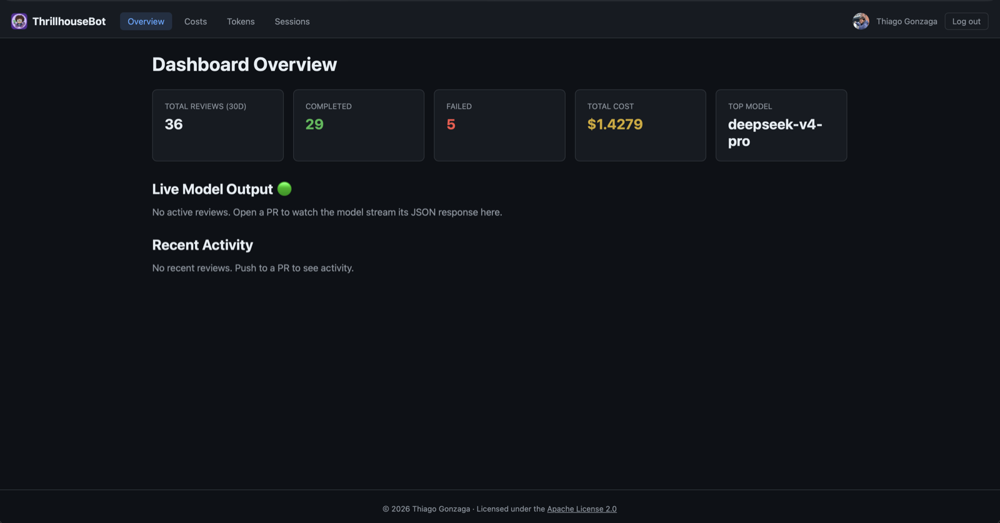
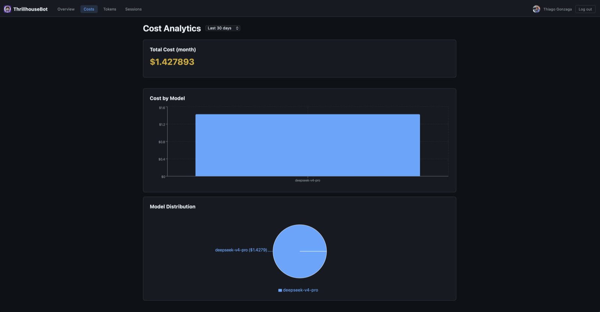
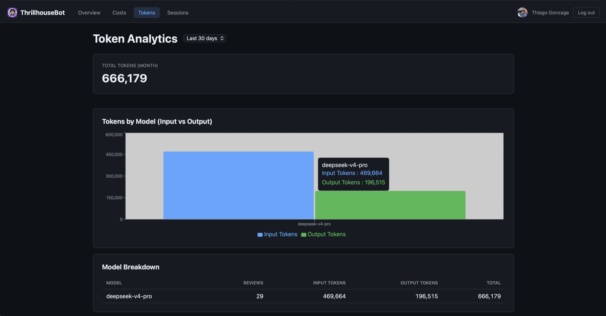
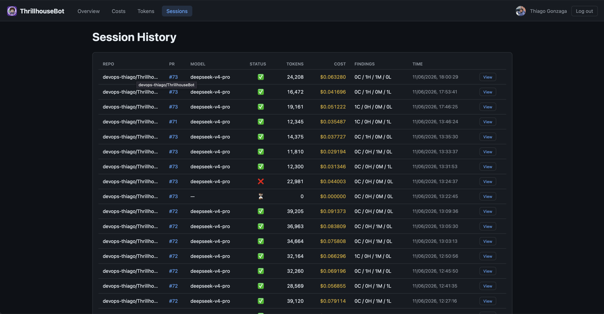
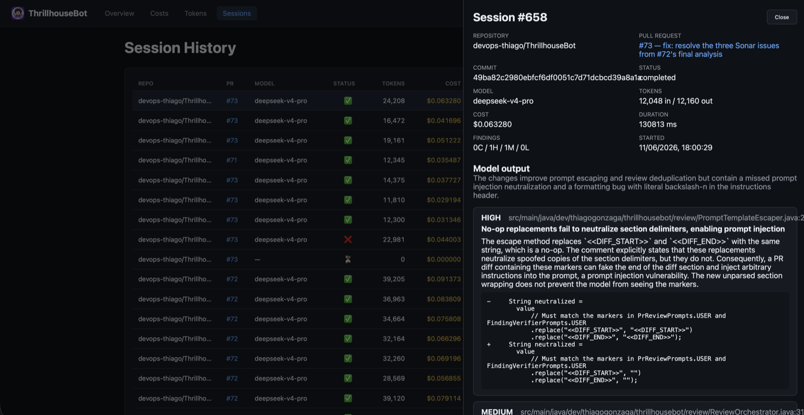

<p align="center">
  
</p>

# ThrillhouseBot

> **"Everything's coming up Thrillhouse!"**

<p align="center">
  <a href="https://github.com/devops-thiago/ThrillhouseBot/actions/workflows/ci.yml"></a>
  <a href="https://codecov.io/gh/devops-thiago/ThrillhouseBot"></a>
  <a href="https://sonarcloud.io/dashboard?id=devops-thiago_ThrillhouseBot"></a>
  <a href="https://securityscorecards.dev/viewer/?uri=github.com/devops-thiago/ThrillhouseBot"></a>
  <a href="https://www.bestpractices.dev/projects/13330"></a>
  <a href="https://github.com/devops-thiago/ThrillhouseBot/releases"></a>
  <a href="LICENSE"></a>
</p>

A GraalVM-native PR review bot, built as a GitHub App with Quarkus. It reviews
pull requests using any OpenAI-compatible chat API, so the review is
language-agnostic and you can pick the provider that suits you.

See [how it compares](docs/COMPARISON.md) to CodeRabbit, PR-Agent, and Copilot
code review.

**[📖 Documentation](https://devops-thiago.github.io/ThrillhouseBot/)** — setup
guide, configuration reference, architecture, comparison, and the hosted
[GitHub App installer](https://devops-thiago.github.io/ThrillhouseBot/install.html).

<p align="center">
  
</p>

<p align="center">
  
</p>

## Features

<!-- docs:features:start -->
- Reviews diffs for correctness, security, regressions, stale comments, and code quality
- Token-budgeted whole-PR review for large diffs — split into map-reduce batches with omitted files named, not silently dropped
- Configurable auto-review triggers — skip drafts, gate on labels, or filter by base branch — plus a per-PR auto-review interval (`AUTO_REVIEW_MIN_INTERVAL`) so busy PRs are not re-reviewed on every push
- Inline code suggestions on review comments that you can apply with one click
- Every finding is tagged `critical`, `high`, `medium`, or `low`
- Follow-up reviews track whether earlier findings were addressed or justified
- Conversational replies: `@thrillhousebot` it in a PR thread or finding reply and the bot answers in context
- A summary comment on the first run, with a risk breakdown and a changed-files walkthrough
- Operable from the PR with comment commands — `/help`, `/review`, `/summary`, `/describe`, `/changelog`, `/add-docs`, `/resolve`, `/pause`, `/resume`
- Live dashboard (Next.js) with a WebSocket activity feed, cost charts, and token tracking
- OpenTelemetry traces, token histograms, cost counters, and latency metrics
- Optional reasoning-effort dial and per-model generation/budget caps for OpenAI-compatible endpoints
- Reads per-repo instructions from `.github/thrillhousebot.md`, falling back to Copilot/Claude/Agents files
- Compiles ahead-of-time with GraalVM/Mandrel, so it starts fast and stays small
<!-- docs:features:end -->

## Provider support

<!-- docs:providers:start -->
ThrillhouseBot talks to any endpoint that implements the OpenAI chat-completions
API. Point `AI_BASE_URL` and `AI_MODEL` at your provider of choice:

| Provider | `AI_BASE_URL` | Example `AI_MODEL` |
|---|---|---|
| DeepSeek | `https://api.deepseek.com/v1` | `deepseek-chat` |
| OpenRouter | `https://openrouter.ai/api/v1` | `openai/gpt-4o-mini` |
| Alibaba Cloud (Model Studio) | `https://dashscope-intl.aliyuncs.com/compatible-mode/v1` | `qwen-plus` |
| OpenAI | `https://api.openai.com/v1` | `gpt-4o-mini` |
| Ollama (local) | `http://localhost:11434/v1` | `llama3.2` |

The default is DeepSeek, used only because it is inexpensive; nothing in the bot
is tied to it.
<!-- docs:providers:end -->

## Commands

<!-- docs:commands:start -->
Drive the bot directly from a PR by commenting one of these. Each also accepts the
mention form, e.g. `@Thrillhousebot review`. The bot acknowledges every command
instantly with a 👀 reaction on your comment while the work runs in the background;
a conversational `@thrillhousebot` mention (no command word) gets an answer instead,
not a reaction.

| Command | What it does | Access |
|---|---|---|
| `/help` | List the available commands | anyone |
| `/review` | Run (or re-run) a full review of the PR | write |
| `/summary` | Post the PR summary if it isn't already on the PR — regenerates it if the comment was deleted, otherwise no-op | write |
| `/describe` | Suggest an improved PR title and description generated from the diff, as a comment to copy in (never overwrites the PR) | write |
| `/changelog` | Draft a CHANGELOG entry for the PR from the diff (Added/Changed/Fixed/Security…), as a comment to copy into `CHANGELOG.md` (never commits) | write |
| `/add-docs` | Generate docstrings/inline docs for the symbols changed in the PR, posted as committable suggestions (or a note with the drafted docs when a multi-line declaration can't be pinned to a single diff hunk) | write |
| `/resolve` | Resolve ThrillhouseBot's outstanding finding threads on the PR | write |
| `/pause` | Silence the bot on the PR | write |
| `/resume` | Re-enable the bot on a paused PR | write |

**Access** — every command except `/help` requires the commenter to hold write access to
the repository (or to be named in
`THRILLHOUSEBOT_REVIEW_MANUAL_TRIGGER_ALLOWED_LOGINS`), since reviews spend the operator's
AI budget.

**Pause** — while a PR is paused, ThrillhouseBot skips automatic reviews on new commits,
ignores `/review`, `/summary`, `/describe`, `/changelog`, and `/add-docs`, and does not answer
`@thrillhousebot` mentions (it replies once to say it is paused). `/resume` lifts the pause.
`/help` and `/resolve` keep working while paused.

**`/add-docs`** — on demand, the bot reads the diff and proposes documentation comments for
the public symbols changed in the PR, honoring the repository instructions and each file's
language. Each suggestion is a committable `suggestion` block placed on the symbol's
declaration (spanning the whole signature when it wraps), so it only inserts docs without
rewriting code. When a multi-line declaration can't be pinned to a single diff hunk, the bot
posts a note with the drafted docs to add manually instead of a committable suggestion. It
spends AI budget per run; operators can turn it off with `REVIEW_ADD_DOCS_ENABLED=false`.
<!-- docs:commands:end -->

## Quick start

### Prerequisites

- [Docker & Docker Compose](https://docs.docker.com/compose/install/)
- An API key for any [OpenAI-compatible provider](#provider-support)

### 1. Create the GitHub App

Follow the [GitHub App setup](#github-app-setup) section below (2 minutes).
You'll get an App ID, private key, webhook secret, and OAuth client ID/secret.

### 2. Clone and configure

```bash
git clone https://github.com/devops-thiago/ThrillhouseBot.git && cd ThrillhouseBot
cp .env.example .env
```

Edit `.env` with the credentials from step 1:

| Variable | Value |
|---|---|
| `GITHUB_APP_ID` | From GitHub App settings → About |
| `GITHUB_PRIVATE_KEY` | Downloaded when you generated a private key |
| `GITHUB_WEBHOOK_SECRET` | The webhook secret you set |
| `GITHUB_CLIENT_ID` | From app settings → Identifying and authorizing users |
| `GITHUB_CLIENT_SECRET` | From app settings → Identifying and authorizing users |
| `AI_API_KEY` | Your AI provider's API key |

### 3. Start the bot

```bash
docker compose up -d
```

The bot is running on `http://localhost:8080`. Point your reverse proxy at it and
you're done.

## GitHub App setup

Create a GitHub App before starting the bot; you'll need its credentials for `.env`.

### Option A: manifest install (recommended)

1. Open the hosted installer at
   [devops-thiago.github.io/ThrillhouseBot/install.html](https://devops-thiago.github.io/ThrillhouseBot/install.html),
   type the public hostname where the bot will run (for local dev with
   [Smee.io](https://smee.io/), your Smee channel URL — the webhook is then
   registered at the channel root, which the smee client forwards to the
   bot's local `/api/webhook`), and click
   **Create ThrillhouseBot GitHub App**. GitHub creates the app from the manifest.

   <details>
   <summary>Offline alternative: serve the installer locally</summary>

   Edit `manifest.json` in the repo root and replace every `<your-host>` with your
   public hostname (no trailing slash), serve the repo root locally:

   ```bash
   java -m jdk.httpserver -p 8081
   ```

   then open [http://localhost:8081/install.html](http://localhost:8081/install.html) and click
   **Create ThrillhouseBot GitHub App**.

   </details>

2. On the confirmation page, note the **App ID**, generate a **private key**, and create a
   **webhook secret**. Copy the **Client ID** and **Client secret** from the app's
   *Identifying and authorizing users* settings (needed for dashboard login).
3. Install the app on your account or organization, then copy the values into `.env`.

   Alternatively, generate `.env` automatically from the manifest conversion response:

   ```bash
   gh api --method POST /app-manifests/<code>/conversions \
     | java scripts/GenEnv.java --host <your-host>
   ```

> Once the bot is running, `install.html` on the bot's own URL (`https://<your-host>/install.html`
> behind a reverse proxy, or `http://localhost:8080/install.html` directly) auto-detects the URL
> and builds the manifest dynamically, with no file editing or local server needed.

### Option B: manual registration

| Setting | Value |
|---|---|
| Webhook URL | `https://<your-host>/api/webhook` |
| Webhook Secret | Random string |
| Repository Permissions | Pull Requests: R/W, Checks: R/W, Contents: Read, Issues: R/W, Actions: Read, Commit Statuses: Read |
| Subscribe to Events | Pull Request, Issue comment, Pull request review comment |
| Identifying & authorizing users | Enabled (for dashboard login) |
| Callback URL | `https://<your-host>/api/auth/callback` |

## Configuration

<!-- docs:configuration:start -->
Configuration is read from environment variables (see `.env.example`). Short
names (`AI_*`, `REVIEW_*`, `WEBHOOK_*`, ...) are explicit aliases; every other
`thrillhousebot.*` key is settable through the standard Quarkus env-var mapping
— uppercase with `.`/`-` replaced by `_` (e.g. `thrillhousebot.review.ignored-files`
→ `THRILLHOUSEBOT_REVIEW_IGNORED_FILES`). The AI variables are the ones you
will change per provider:

| Variable | Purpose | Default |
|---|---|---|
| `AI_API_KEY` | API key for the AI provider | _(required)_ |
| `AI_BASE_URL` | OpenAI-compatible base URL | `https://api.deepseek.com/v1` |
| `AI_MODEL` | Chat model name | `deepseek-chat` |
| `AI_PROVIDER` | Provider label for telemetry (`gen_ai.provider.name`); derived from `AI_BASE_URL` when unset | _(derived)_ |
| `AI_TIMEOUT` | Per-request timeout | `300s` |
| `AI_REASONING_ENABLED` | Send a reasoning hint to reasoning-capable models; when `false` no reasoning parameter is sent and the provider default applies | `false` |
| `AI_REASONING_EFFORT` | Effort sent while enabled: `none`/`low`/`medium`/`high` (`none` explicitly asks the model not to reason); reasoning tokens are billed as output tokens | `low` |
| `GITHUB_APP_ID` | GitHub App ID | _(required)_ |
| `GITHUB_PRIVATE_KEY` | GitHub App private key (PEM) | _(required)_ |
| `GITHUB_WEBHOOK_SECRET` | Webhook HMAC secret | _(required)_ |
| `GITHUB_BOT_LOGINS` | Comma-separated bot account login(s) the bot skips to avoid replying to itself; override when deployed under a different App slug (`<app-slug>[bot]`) | `thrillhousebot[bot],thrillhouse-bot[bot]` |
| `WEBHOOK_DEDUP_TTL` | Webhook deduplication time-to-live for GitHub redeliveries | `24h` |
| `THRILLHOUSEBOT_REVIEW_MANUAL_TRIGGER_ALLOWED_LOGINS` | Comma-separated allowlist of logins permitted to trigger manual `/review` without repo access | _(empty)_ |
| `MANUAL_TRIGGER_AUTH_TIMEOUT` | Upper bound on the manual-trigger write-access check on the webhook ACK thread; fails closed (denies) if GitHub is slower | `5s` |
| `ACK_REACTION_TIMEOUT` | Upper bound on the 👀 command-ack reaction on the webhook ACK thread; the wait is abandoned (reaction may land late) if GitHub is slower | `3s` |
| `AUTO_REVIEW_MIN_INTERVAL` | Minimum interval between automatic reviews of the same PR — pushes within the window are skipped silently, even on a new head SHA (in-memory, per replica). A manual `/review` always bypasses; `0` disables | `1h` |
| `WEBHOOK_SKIP_DRAFTS` | Skip auto-review while a PR is a draft (reviewed once marked ready / on later pushes) | `false` |
| `WEBHOOK_REQUIRED_LABELS` | Comma-separated labels; only auto-review PRs carrying at least one (case-insensitive) | _(empty — no gate)_ |
| `WEBHOOK_EXCLUDED_LABELS` | Comma-separated labels; skip auto-review of PRs carrying any (wins over required) | _(empty)_ |
| `WEBHOOK_BASE_BRANCHES` | Comma-separated globs; only auto-review PRs whose base branch matches one (e.g. `main,release/*`). Globs are gitignore-style: `*` does **not** cross `/`, so use `**` to span slashes (`**` alone matches every branch) | _(empty — all branches)_ |
| `WEBHOOK_IGNORED_BASE_BRANCHES` | Comma-separated globs; skip auto-review of PRs whose base branch matches one (wins over allowlist; same `*`/`**` rule — match nested branches with `**`, e.g. `dependabot/**`) | _(empty)_ |
| `REVIEW_VERIFIER_ENABLED` | Second, skeptical AI pass that re-checks each finding against the diff before posting, dropping or downgrading what it can't confirm (see [AI call budget](#ai-call-budget)); fails open — a verifier error keeps the original findings | `true` |
| `REVIEW_CONVERSATIONAL_REPLIES_ENABLED` | Answer `@thrillhousebot` mentions in PR threads (including finding replies) with an AI reply | `true` |
| `REVIEW_ADD_DOCS_ENABLED` | Allow the on-demand `/add-docs` command to generate docstrings as committable suggestions | `true` |
| `REVIEW_DIAGRAM_ENABLED` | Include an opt-in Mermaid control-flow diagram in the PR summary | `false` |
| `REVIEW_MAX_INPUT_TOKENS` | Per-call input-token budget for review calls; large PRs are split into batches that each fit it. Bounded by the active model's input cap (see [Per-model AI settings](#per-model-ai-settings)). `0` disables token budgeting | `48000` |
| `REVIEW_OUTPUT_BUFFER_TOKENS` | Tokens reserved out of the input budget for the model's response | `8192` |
| `REVIEW_MAX_AI_CALLS` | Cap on AI calls per review (batch calls plus the final summary call); files that still don't fit are reported by name as omitted | `6` |
| `REVIEW_TOKEN_SAFETY_MARGIN` | Fraction of the input budget actually used, absorbing token-estimate error | `0.9` |
| `REVIEW_MAX_DIFF_LINES` | Line cap on single-call diff renders (`/describe`, `/changelog`, `/add-docs`, replies, budgeting-disabled review). Token-budgeted reviews ignore it (planner owns coverage by tokens); `0` disables the cap | `5000` |
| `THRILLHOUSEBOT_REVIEW_MAX_REVIEW_COMMENTS` | Maximum inline comments posted per review; findings over the cap are surfaced in the summary instead of dropped | `50` |
| `THRILLHOUSEBOT_REVIEW_MAX_AI_RETRIES` | Attempts per failed AI call before the review errors out | `5` |
| `THRILLHOUSEBOT_REVIEW_AI_RETRY_BASE_DELAY_MS` | Base delay of the exponential retry backoff, in milliseconds | `2000` |
| `THRILLHOUSEBOT_REVIEW_AI_TIMEOUT_SECONDS` | Client-side wait per AI streaming attempt; keep it >= `AI_TIMEOUT` so timed-out attempts don't leave orphaned provider streams | `300` |
| `THRILLHOUSEBOT_REVIEW_INSTRUCTIONS_FILE` | Repo-relative path of the per-repo instructions file read on each review | `.github/thrillhousebot.md` |
| `THRILLHOUSEBOT_REVIEW_IGNORED_FILES` | Comma-separated gitignore-style globs excluded from review — lockfiles, generated code, build output. `*` does not cross `/`; use `**` to span directories. Replaces (not extends) the default list, so re-include the defaults you still want | `**/pom.xml,**/package-lock.json,**/*.lock,**/*.generated.*,**/target/**` |
| `REVIEW_LABELS_ENABLED` | Opt in to context-aware PR labels (see [PR labels](#pr-labels)) | `false` |
| `REVIEW_LABELS_APPLY` | When labels are enabled, add them to the PR instead of only suggesting them in a comment | `false` |
| `REVIEW_LABELS_ALLOW_CREATE` | Allow the bot to create suggested labels that don't exist yet | `false` |
| `REVIEW_LABELS_MAX` | Maximum labels applied or suggested per PR | `3` |
| `GITHUB_CLIENT_ID` / `GITHUB_CLIENT_SECRET` | OAuth credentials for dashboard login | _(required for dashboard)_ |
| `DASHBOARD_URL` | Public dashboard URL (OAuth callback base) | `http://localhost:8080` |
| `DATASOURCE_DB_KIND` | `h2` or `postgresql` | `h2` (dev), `postgresql` (`%prod`) |
| `HTTP_CONNECT_TIMEOUT` | Outbound HTTP connect timeout (GitHub API, OAuth) | `10s` |
| `HTTP_REQUEST_TIMEOUT` | Outbound HTTP request timeout (GitHub API, OAuth) | `10s` |
| `WEBSOCKET_KEEPALIVE_MS` | Dashboard WebSocket keepalive interval in ms; `0` or negative disables it (and stale replay-buffer eviction) | `25000` |

### AI call budget

A review that reports findings makes **two** model calls by default, not one:
the review call itself plus a verification call that re-sends the diff and the
candidate findings, so budget roughly **2× tokens** per flagged review. On
large PRs under token-aware budgeting this becomes N batch review calls + N
per-batch verification calls + one summary call. Set
`REVIEW_VERIFIER_ENABLED=false` to skip only the AI verifier — cheaper, at the
cost of more false positives; a deterministic hedging guard still runs, and a
verifier failure never blocks the review (it fails open, keeping the original
findings).

The app validates configuration at startup and **fails fast** if a required value
(`GITHUB_APP_ID`, `GITHUB_PRIVATE_KEY`, `GITHUB_WEBHOOK_SECRET`, `AI_API_KEY`) is missing or — for
the private key — not a valid PEM RSA key, naming every offending variable in one message instead of
surfacing later on the first webhook or review. Dashboard OAuth (`GITHUB_CLIENT_ID` /
`GITHUB_CLIENT_SECRET`) is optional: leave both unset and the dashboard login is simply disabled.

Cost tracking uses per-model pricing keyed by the model name, for example:

```properties
thrillhousebot.ai.pricing.deepseek-chat.input-per-1k=0.00014
thrillhousebot.ai.pricing.deepseek-chat.output-per-1k=0.00028
```

If you switch to a different `AI_MODEL`, add a matching
`thrillhousebot.ai.pricing.<model>.*` pair so the dashboard can compute cost.
Without an entry the bot still records tokens, but warns once and flags sessions
as "no pricing" instead of showing `$0`.

### Per-model AI settings

Model-specific settings live under `thrillhousebot.ai.models.<model>.*`, keyed
by the model name (the `AI_MODEL` value) like the pricing map. Only the active
model's entry is read, so you can keep entries for every model you use and
switch `AI_MODEL` freely:

```properties
# Input hard cap (the model's context window). The effective review budget is
# min(REVIEW_MAX_INPUT_TOKENS, cap); models without an entry get a 128000 cap.
thrillhousebot.ai.models.deepseek-chat.max-input-tokens=64000
# Per-model overrides of REVIEW_OUTPUT_BUFFER_TOKENS / REVIEW_TOKEN_SAFETY_MARGIN
thrillhousebot.ai.models.deepseek-chat.output-buffer-tokens=8192
thrillhousebot.ai.models.deepseek-chat.token-safety-margin=0.9
# Generation parameters, sent on every chat call when set
thrillhousebot.ai.models.deepseek-chat.temperature=0.2
thrillhousebot.ai.models.deepseek-chat.top-p=0.95
thrillhousebot.ai.models.deepseek-chat.max-output-tokens=8192
```

Notes:

- **`max-input-tokens` is a cap, not the budget.** `REVIEW_MAX_INPUT_TOKENS`
  stays the spend knob; the per-model value keeps it from overshooting the
  model's real window. To use a large-context model beyond 128k, raise both.
  Startup logs a warning whenever the cap lowers your configured budget.
- **Quote keys with `.` or `/`** (`thrillhousebot.ai.models."gpt-5.5".…`), the
  same rule as the pricing map. Map keys don't survive env-var name mangling,
  so set these in an external `application.properties` or as `-D` system
  properties rather than environment variables.
- **`top_k` is not available** on the OpenAI-compatible wire; it becomes
  relevant only with native provider integrations.
- **Generation-parameter validation** happens at boot: temperature must be in
  `[0, 2]`, `top-p` in `(0, 1]`, token counts positive — a typo in any entry
  (even an inactive model's) fails startup with a message naming the key.
<!-- docs:configuration:end -->

## Dashboard

After logging in with GitHub OAuth, the dashboard shows an overview page with
summary cards and a live activity feed, plus tabs for cost charts by model,
input/output token breakdowns, and a paginated session history with PR links.

Access is restricted: the GitHub App owner always has access, and any other login
must be a collaborator on at least one repository where the app is installed
(under that owner account). Everyone else sees an access-denied screen. The owner
is resolved from the app registration; set `thrillhousebot.dashboard.github.account-owner`
to pin it explicitly when auto-detection fails.

| | |
|---|---|
|  |  |
|  |  |

The Overview has summary cards, a recent-activity feed, and a live panel that
streams the model's output as a review runs. On large, map-reduce reviews (token
budgeting) per-token streaming is off and the panel shows `review.batch` progress
(batch X/Y) instead of an empty token stream:

<p align="center">
  
</p>

## Repository instructions

Place a `.github/thrillhousebot.md` file in any repo to customize the review:

```markdown
## Review Priorities
1. Payment calculations must be exact; flag any floating-point usage
2. All DB queries must use the repository pattern, never raw SQL

## Known Gotchas
- The `price` field in Product is in cents, not dollars
```

Fallback chain: `.github/thrillhousebot.md` → `.github/copilot-instructions.md` → `CLAUDE.md` → `AGENTS.md` → `AGENT.md`

<!-- docs:pr-labels:start -->
## PR labels

ThrillhouseBot can suggest context-aware labels (area, change type, risk) drawn
from the diff. The feature is **off by default**; turn it on with
`REVIEW_LABELS_ENABLED=true`.

When enabled, the model is shown the repository's existing labels and picks the
few that best describe the PR — it only ever chooses from labels that already
exist, so it respects whatever label scheme the repo already uses. What happens
next depends on `REVIEW_LABELS_APPLY`:

- `false` (default): the suggestions are posted as a one-line comment on the
  first review, leaving the decision to a maintainer.
- `true`: the labels are added to the PR automatically.

Set `REVIEW_LABELS_ALLOW_CREATE=true` to let the bot create a suggested label
that doesn't exist yet (off by default, so it never invents labels), and
`REVIEW_LABELS_MAX` to cap how many labels it applies or suggests (default `3`).
Labelling is best-effort — a failure here never blocks or fails the review.
<!-- docs:pr-labels:end -->

## Observability

All telemetry is exported via OTLP:

| Signal | Metric |
|---|---|
| Traces | One span per LLM call with request/response events |
| `gen_ai.client.token.usage` | Histogram: input/output tokens |
| `gen_ai.client.operation.duration` | Histogram: latency in seconds |
| `thrillhouse.ai.cost.total` | Counter: USD cost by model |

Spans and metrics are tagged with `gen_ai.provider.name`, derived from `AI_BASE_URL`
(e.g. `deepseek`, `openai`, `groq`, `openrouter`). Loopback and unrecognized endpoints
report `unknown`; set `AI_PROVIDER` to label them (e.g. a local `ollama` or `vllm` server,
a proxy, or a self-hosted gateway).

## Responsible use and security

AI review is advisory. The model can be wrong in both directions: it raises
false positives and misses real bugs. Treat its findings as suggestions and
confirm them yourself before acting.

Pull request diffs are sent to whatever endpoint you configure, so use an HTTPS
endpoint with an API key, and read the provider's data-retention policy before
sending it private code.

Set `AI_API_KEY`, `GITHUB_PRIVATE_KEY`, and the webhook secret through your
environment or a secret manager. Never commit them.

To report a vulnerability, see [SECURITY.md](SECURITY.md).

## Known limitations

This is still an early-stage project; the current constraints are:

- **GitHub only** — no GitLab or Bitbucket integration.
- **Large diffs** — reviews are token-budgeted (`REVIEW_MAX_INPUT_TOKENS`): big PRs are
  split into up to `REVIEW_MAX_AI_CALLS - 1` batched review calls, and files that still
  don't fit are disclosed by name instead of silently dropped. The on-demand commands
  (`/describe`, `/changelog`, `/add-docs`) still send the diff in a single call without
  batching.
- **Single process** — OAuth login sessions, the live WebSocket replay buffer, and
  the per-PR auto-review rate-limit window are in-memory (lost on restart / not shared
  across replicas). Review history and cost totals persist in PostgreSQL.
  Multiple replicas are unsupported.
- **Dashboard access** — GitHub OAuth required. Only the app account owner and
  collaborators on installed repos can use the dashboard; no admin UI or guest mode.
  If the app owner cannot be resolved from GitHub, the dashboard fails closed (denies all access) until
  `thrillhousebot.dashboard.github.account-owner` is set.
- **Production database** — container and native production builds use PostgreSQL
  (`%prod`). H2 is for local `quarkus:dev` only.
- **OpenAI-compatible APIs only** — endpoints must implement the chat-completions
  API shape LangChain4j expects.
- **Cost tracking** — needs a `thrillhousebot.ai.pricing.<model>.*` entry per model.
  A model without one logs a startup-style warning (once per model), and its sessions
  are flagged "no pricing" in the dashboard instead of masquerading as `$0`; token
  counts stay accurate, and adding the pricing entry backfills the flagged sessions
  on the next restart.
- **Review output caps** — at most 50 inline PR comments per review
  (`thrillhousebot.review.max-review-comments`). Lockfiles, `pom.xml`, generated
  paths, and `target/` are skipped by default (`thrillhousebot.review.ignored-files`).
- **Self-hosted** — no managed offering from this project.

## Verifying a release

Release images are signed with cosign (keyless, via Sigstore) and carry build
provenance attestations, as do the binary tarballs. To check a release before
running it:

```bash
# Signature
cosign verify \
  --certificate-identity-regexp='https://github.com/devops-thiago/ThrillhouseBot.*' \
  --certificate-oidc-issuer='https://token.actions.githubusercontent.com' \
  ghcr.io/devops-thiago/thrillhousebot:v0.1.0

# Provenance (image)
gh attestation verify oci://ghcr.io/devops-thiago/thrillhousebot:v0.1.0 \
  --repo devops-thiago/ThrillhouseBot

# Provenance (a downloaded binary)
gh attestation verify thrillhousebot-v0.1.0-linux-amd64.tar.gz \
  --repo devops-thiago/ThrillhouseBot
```

## Development

For local development without Docker, you'll need Java 25+, Node.js 20+ (dashboard),
and a [Smee.io](https://smee.io/) channel for webhook forwarding. Use `./mvnw`
for Maven (wrapper included).

### Dev mode

```bash
# Terminal 1: Smee proxy
smee -u https://smee.io/YOUR_CHANNEL -t http://localhost:8080/api/webhook

# Terminal 2: Quarkus dev mode
./mvnw quarkus:dev
```

### Build the dashboard

```bash
cd frontend
npm install
npm run build
cp -r out/* ../src/main/resources/META-INF/resources/dashboard/
```

### Build the native image

```bash
./mvnw package -Pnative -DskipTests -Dquarkus.native.container-build=true
```

### Run tests & checks

```bash
./mvnw verify
./mvnw spotless:check
```

See [CONTRIBUTING.md](CONTRIBUTING.md) for the full development workflow.

## Community

Questions and setup help belong in [GitHub Discussions](https://github.com/devops-thiago/ThrillhouseBot/discussions) (see the pinned welcome post). Use [Issues](https://github.com/devops-thiago/ThrillhouseBot/issues/new/choose) for bugs and feature requests.

## Architecture

See [docs/ARCHITECTURE.md](docs/ARCHITECTURE.md).

## Tech stack

| Layer | Choice |
|---|---|
| Framework | Quarkus 3.36 (REST) |
| LLM | LangChain4j 1.10 (OpenAI-compatible API) |
| Frontend | Next.js 16 + React 19 (static export) |
| Database | H2 (dev) / PostgreSQL (prod) + Panache |
| Observability | OpenTelemetry |
| Native | GraalVM / Mandrel |
| Container | UBI9-micro (default) / distroless (`-distroless`) |

## Container images

Published to GHCR from the same native binary:

- `ghcr.io/devops-thiago/thrillhousebot:latest` — UBI9-micro (default).
- `ghcr.io/devops-thiago/thrillhousebot:latest-distroless` — distroless base
  (`:v0.1.0-distroless`, etc.).
- Snapshot tags: `:snapshot`, `:v0.1.0-<sha>-snapshot`, `:<full-sha>` (and
  `-distroless` variants).

Both flavours are multi-arch (linux/amd64, linux/arm64), signed with cosign, and
carry build-provenance attestations (see [Verifying a release](#verifying-a-release)).

## License

Licensed under the [Apache License 2.0](LICENSE) (SPDX: `Apache-2.0`).
