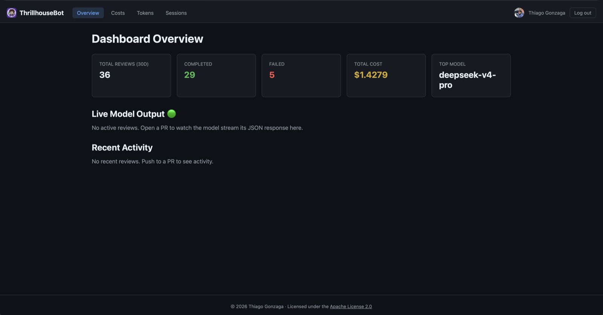
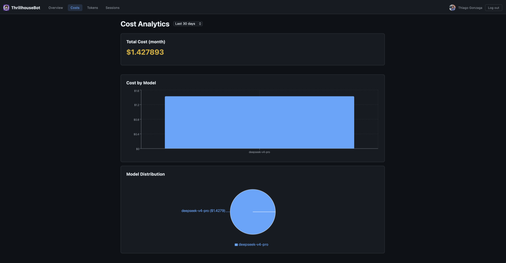
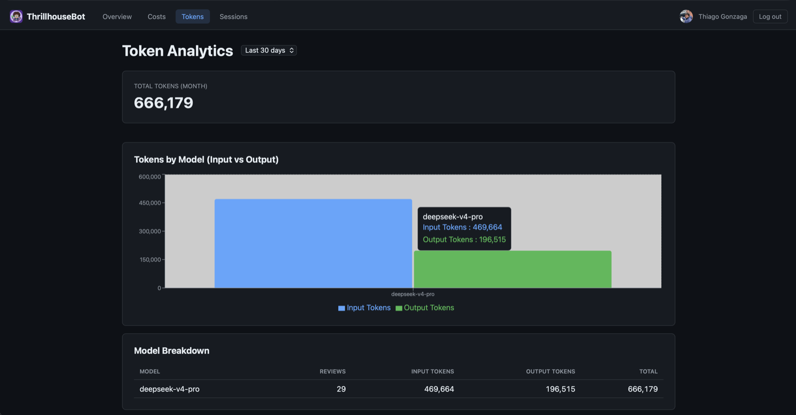
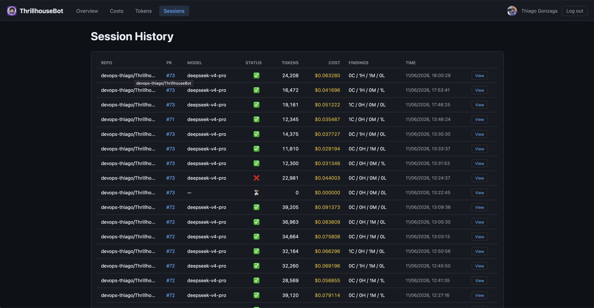
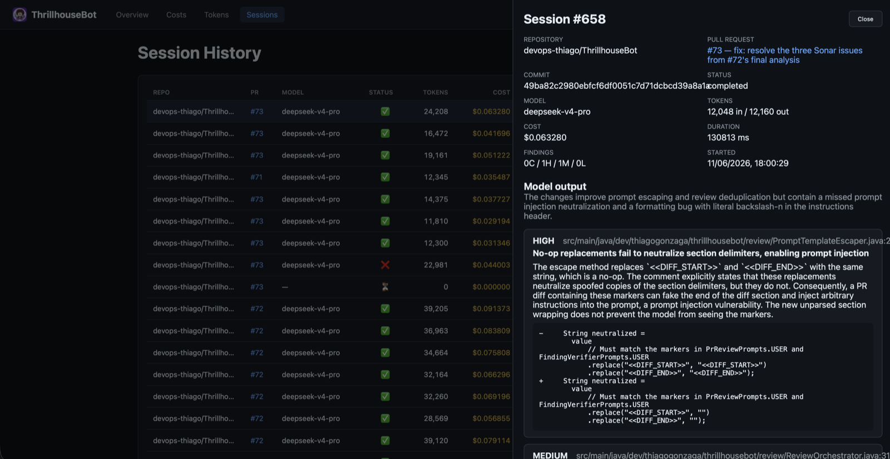
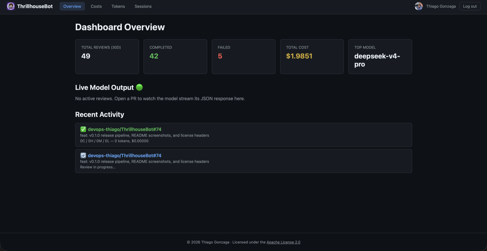

<p align="center">
  
</p>

# ThrillhouseBot

> **"Everything's coming up Thrillhouse!"**

<p align="center">
  <a href="https://github.com/devops-thiago/ThrillhouseBot/actions/workflows/ci.yml"></a>
  <a href="https://codecov.io/gh/devops-thiago/ThrillhouseBot"></a>
  <a href="https://sonarcloud.io/dashboard?id=devops-thiago_ThrillhouseBot"></a>
  <a href="https://securityscorecards.dev/viewer/?uri=github.com/devops-thiago/ThrillhouseBot"></a>
  <a href="https://www.bestpractices.dev/projects/13330"></a>
  <a href="https://github.com/devops-thiago/ThrillhouseBot/releases"></a>
  <a href="LICENSE"></a>
</p>

A GraalVM-native PR review bot, built as a GitHub App with Quarkus. It reviews
pull requests using any OpenAI-compatible chat API, so the review is
language-agnostic and you can pick the provider that suits you.

See [how it compares](docs/COMPARISON.md) to CodeRabbit, PR-Agent, and Copilot
code review.

**[📖 Documentation](https://devops-thiago.github.io/ThrillhouseBot/)** — setup
guide, configuration reference, architecture, comparison, and the hosted
[GitHub App installer](https://devops-thiago.github.io/ThrillhouseBot/install.html).

<p align="center">
  
</p>

<p align="center">
  
</p>

## Features

<!-- docs:features:start -->
- Reviews diffs for correctness, security, regressions, stale comments, and code quality
- Token-budgeted whole-PR review for large diffs — split into parallel map-reduce batches with omitted files named, not silently dropped
- Configurable auto-review triggers — skip drafts, gate on labels, or filter by base branch — plus an optional per-PR auto-review interval (`AUTO_REVIEW_MIN_INTERVAL`) when you want to cap spend on noisy PRs (off by default; use `/pause` to silence a PR)
- Inline code suggestions on review comments that you can apply with one click
- Every finding is tagged `critical`, `high`, `medium`, or `low`
- Follow-up reviews track whether earlier findings were addressed or justified
- Every finding can be closed by a maintainer: reply on its review thread, or — for one raised below the inline-posting bar, which has no thread — comment `@thrillhousebot resolved <path>:<line> — <title>` on the PR
- Maintainer 👍/👎 (and "not useful" replies) on finding comments are recorded for a future learnings pipeline — see [Finding feedback](https://devops-thiago.github.io/ThrillhouseBot/feedback/)
- Conversational replies: `@thrillhousebot` it in a PR thread or finding reply and the bot answers in context
- A summary comment on the first run, with a risk breakdown and a changed-files walkthrough
- Operable from the PR with comment commands — `/help`, `/review`, `/summary`, `/describe`, `/changelog`, `/add-docs`, `/improve`, `/generate-tests`, `/resolve`, `/pause`, `/resume`
- Live dashboard (Next.js) with a WebSocket activity feed, cost charts, and token tracking
- OpenTelemetry traces, token histograms, cost counters, and latency metrics
- Optional reasoning-effort dial and per-model generation/budget caps for OpenAI-compatible endpoints
- Reads per-repo instructions from `.github/thrillhousebot.md`, falling back to Copilot/Claude/Agents files
- Lets each repository add its own ignore globs in `.github/thrillhousebot.yml`, unioned with the deployment default, and scope extra review rules to a path glob
- Compiles ahead-of-time with GraalVM/Mandrel, so it starts fast and stays small
<!-- docs:features:end -->

## Provider support

<!-- docs:providers:start -->
ThrillhouseBot talks to any endpoint that implements the OpenAI chat-completions
API. Point `AI_BASE_URL` and `AI_MODEL` at your provider of choice:

| Provider | `AI_BASE_URL` | Example `AI_MODEL` |
|---|---|---|
| DeepSeek | `https://api.deepseek.com/v1` | `deepseek-chat` |
| OpenRouter | `https://openrouter.ai/api/v1` | `openai/gpt-4o-mini` |
| Alibaba Cloud (Model Studio) | `https://dashscope-intl.aliyuncs.com/compatible-mode/v1` | `qwen-plus` |
| OpenAI | `https://api.openai.com/v1` | `gpt-4o-mini` |
| Ollama (local) | `http://localhost:11434/v1` | `llama3.2` |

The default is DeepSeek, used only because it is inexpensive; nothing in the bot
is tied to it.
<!-- docs:providers:end -->

## Commands

<!-- docs:commands:start -->
Drive the bot directly from a PR by commenting one of these. Each also accepts the
mention form, e.g. `@Thrillhousebot review`. The bot acknowledges every command
instantly with a 👀 reaction on your comment while the work runs in the background;
a conversational `@thrillhousebot` mention (no command word) gets an answer instead,
not a reaction.

| Command | What it does | Access |
|---|---|---|
| `/help` | List the available commands | anyone |
| `/review` | Run (or re-run) a full review of the PR | write |
| `/summary` | Post the PR summary if it isn't already on the PR — regenerates it if the comment was deleted, otherwise no-op | write |
| `/describe` | Suggest an improved PR title and description generated from the diff, as a comment to copy in (never overwrites the PR) | write |
| `/changelog` | Draft a CHANGELOG entry for the PR from the diff (Added/Changed/Fixed/Security…), as a comment to copy into `CHANGELOG.md` (never commits) | write |
| `/add-docs` | Generate docstrings/inline docs for the symbols changed in the PR, posted as committable suggestions (or a note with the drafted docs when a multi-line declaration can't be pinned to a single diff hunk) | write |
| `/improve` | Run a whole-PR improvement pass over the diff and post the improvements as committable suggestions (with copy-paste blocks for the ones that can't be pinned to the diff) | write |
| `/generate-tests` | Propose unit tests for the code the PR changed, as a comment with one ready-to-paste code block per test file (never commits) | write |
| `/resolve` | Resolve ThrillhouseBot's outstanding finding threads on the PR | write |
| `/pause` | Silence the bot on the PR | write |
| `/resume` | Re-enable the bot on a paused PR | write |
| `@thrillhousebot resolved <path>:<line> — <title>` | Close a previous finding that has no review thread to reply on, so it stops holding approval (see **Clearing a finding with no thread** under Configuration) | write |

**Access** — every command except `/help` requires the commenter to hold write access to
the repository (or to be named in
`THRILLHOUSEBOT_REVIEW_MANUAL_TRIGGER_ALLOWED_LOGINS`), since reviews spend the operator's
AI budget.

**`@thrillhousebot resolved`** — a directive, not a slash command: it has no `/resolved`
form, and it is read by the *next* review rather than acted on immediately. The bot replies
straight away to say what that review will evaluate — and, when the comment names no
`path:line` at all, to say plainly that nothing will be cleared, so a mistyped locator shows
up immediately instead of as a review that changes nothing. It is a statement, never a
question: `@thrillhousebot resolved?` is asking, not deciding, and clears nothing. Do not
confuse it with `/resolve`, which resolves GitHub review threads and does nothing to a
finding that never opened one. Its access check is the commenter's GitHub
`author_association` on that comment — `OWNER`, `MEMBER` or `COLLABORATOR` — and
`THRILLHOUSEBOT_REVIEW_MANUAL_TRIGGER_ALLOWED_LOGINS` does *not* extend it.

**Pause** — while a PR is paused, ThrillhouseBot skips automatic reviews on new commits,
ignores `/review`, `/summary`, `/describe`, `/changelog`, `/add-docs`, `/improve` and
`/generate-tests`, and does not answer `@thrillhousebot` mentions (it replies once to say it is
paused). `/resume` lifts the pause.
`/help` and `/resolve` keep working while paused.

**`/describe` and `/changelog`** — both read the whole change set rather than the first
`REVIEW_MAX_DIFF_LINES` of it. The changed files are packed into batches that each fit
`REVIEW_MAX_INPUT_TOKENS`, one model call per batch, and the per-batch results are then reduced
to a single answer: `/describe` composes the partial descriptions into one coherent title and
description, `/changelog` merges the candidate entries into one entry. That reduce step costs one
extra model call, reserved out of `REVIEW_MAX_AI_CALLS` and spent only when the PR actually needed
more than one batch, so a run never exceeds the same ceiling as one review. Any file the budget
could not cover is named in a partial-coverage note under the suggestion.

**`/add-docs`** — on demand, the bot reads the diff and proposes documentation comments for
the public symbols changed in the PR, honoring the repository instructions and each file's
language. Each suggestion is a committable `suggestion` block placed on the symbol's
declaration (spanning the whole signature when it wraps), so it only inserts docs without
rewriting code. When a multi-line declaration can't be pinned to a single diff hunk, the bot
posts a note with the drafted docs to add manually instead of a committable suggestion. It
spends AI budget per run; operators can turn it off with `REVIEW_ADD_DOCS_ENABLED=false`.

**`/improve`** — on demand, the bot runs an improvement pass over the whole PR and proposes
concrete changes the author can commit: clearer naming, dead or duplicated code, simpler
control flow, missing error handling, avoidable work in loops, and gaps in the tests covering
the change. It is deliberately separate from `/review`: `/review` looks for defects,
`/improve` proposes better code even when nothing is broken. Like a review, the pass is
token-budgeted rather than line-capped: the changed files are packed into batches that each fit
`REVIEW_MAX_INPUT_TOKENS`, one model call per batch, so a long diff only loses coverage once it
exceeds the whole budget. Each improvement whose quoted code anchors onto the diff is posted as
an inline committable `suggestion` block on the lines it replaces; the rest are listed as
copy-paste blocks in the run's summary comment, together with a partial-coverage note naming
any file the budget could not cover. Nothing is ever committed for you. It spends AI budget per
run — at most `REVIEW_MAX_AI_CALLS` model calls, the same ceiling as one review — and operators
can turn it off with `REVIEW_IMPROVE_ENABLED=false`.

**`/generate-tests`** — on demand, the bot reads the diff and proposes unit tests for the
behavior the PR added or changed, in the test framework the project already uses. A proposed
test is usually a whole new file, which has no diff line for GitHub to anchor a committable
`suggestion` block to, so each one is posted as a code block headed by the path it belongs at
— ready to paste into a new file, or to merge into an existing test file. Nothing is committed
and no file is edited. Like a review, the pass is token-budgeted rather than line-capped: the
changed files are packed into batches that each fit `REVIEW_MAX_INPUT_TOKENS`, one model call
per batch, and the per-batch proposals are unioned by path — so "nothing here warrants a test"
is never a verdict on code that was too far down a long diff to be read. Any file the budget
could not cover is named in a partial-coverage note. It spends AI budget per run — at most
`REVIEW_MAX_AI_CALLS` model calls, the same ceiling as one review — and operators can turn it
off with `REVIEW_GENERATE_TESTS_ENABLED=false`.
<!-- docs:commands:end -->

## Quick start

### Prerequisites

- [Docker & Docker Compose](https://docs.docker.com/compose/install/)
- An API key for any [OpenAI-compatible provider](#provider-support)

### 1. Create the GitHub App

Follow the [GitHub App setup](#github-app-setup) section below (2 minutes).
You'll get an App ID, private key, webhook secret, and OAuth client ID/secret.

### 2. Clone and configure

```bash
git clone https://github.com/devops-thiago/ThrillhouseBot.git && cd ThrillhouseBot
cp .env.example .env
```

Edit `.env` with the credentials from step 1:

| Variable | Value |
|---|---|
| `GITHUB_APP_ID` | From GitHub App settings → About |
| `GITHUB_PRIVATE_KEY` | Downloaded when you generated a private key |
| `GITHUB_WEBHOOK_SECRET` | The webhook secret you set |
| `GITHUB_CLIENT_ID` | From app settings → Identifying and authorizing users |
| `GITHUB_CLIENT_SECRET` | From app settings → Identifying and authorizing users |
| `AI_API_KEY` | Your AI provider's API key |

### 3. Start the bot

```bash
docker compose up -d
```

The bot is running on `http://localhost:8080`. Point your reverse proxy at it and
you're done.

## GitHub App setup

Create a GitHub App before starting the bot; you'll need its credentials for `.env`.

### Option A: manifest install (recommended)

1. Open the hosted installer at
   [devops-thiago.github.io/ThrillhouseBot/install.html](https://devops-thiago.github.io/ThrillhouseBot/install.html),
   type the public hostname where the bot will run (for local dev with
   [Smee.io](https://smee.io/), your Smee channel URL — the webhook is then
   registered at the channel root, which the smee client forwards to the
   bot's local `/api/webhook`), and click
   **Create ThrillhouseBot GitHub App**. GitHub creates the app from the manifest.

   <details>
   <summary>Offline alternative: serve the installer locally</summary>

   Edit `manifest.json` in the repo root and replace every `<your-host>` with your
   public hostname (no trailing slash), serve the repo root locally:

   ```bash
   java -m jdk.httpserver -p 8081
   ```

   then open [http://localhost:8081/install.html](http://localhost:8081/install.html) and click
   **Create ThrillhouseBot GitHub App**.

   </details>

2. On the confirmation page, note the **App ID**, generate a **private key**, and create a
   **webhook secret**. Copy the **Client ID** and **Client secret** from the app's
   *Identifying and authorizing users* settings (needed for dashboard login).
3. Install the app on your account or organization, then copy the values into `.env`.

   Alternatively, generate `.env` automatically from the manifest conversion response:

   ```bash
   gh api --method POST /app-manifests/<code>/conversions \
     | java scripts/GenEnv.java --host <your-host>
   ```

> Once the bot is running, `install.html` on the bot's own URL (`https://<your-host>/install.html`
> behind a reverse proxy, or `http://localhost:8080/install.html` directly) auto-detects the URL
> and builds the manifest dynamically, with no file editing or local server needed.

### Option B: manual registration

| Setting | Value |
|---|---|
| Webhook URL | `https://<your-host>/api/webhook` |
| Webhook Secret | Random string |
| Repository Permissions | Pull Requests: R/W, Checks: R/W, Contents: Read, Issues: R/W, Actions: Read, Commit Statuses: Read |
| Subscribe to Events | Pull Request, Issue comment, Pull request review comment |
| Identifying & authorizing users | Enabled (for dashboard login) |
| Callback URL | `https://<your-host>/api/auth/callback` |

## Configuration

<!-- docs:configuration:start -->
Configuration is read from environment variables (see `.env.example`). Short
names (`AI_*`, `REVIEW_*`, `WEBHOOK_*`, ...) are explicit aliases; every other
`thrillhousebot.*` key is settable through the standard Quarkus env-var mapping
— uppercase with `.`/`-` replaced by `_` (e.g. `thrillhousebot.review.ignored-files`
→ `THRILLHOUSEBOT_REVIEW_IGNORED_FILES`). The AI variables are the ones you
will change per provider:

| Variable | Purpose | Default |
|---|---|---|
| `AI_API_KEY` | API key for the AI provider | _(required)_ |
| `AI_BASE_URL` | OpenAI-compatible base URL | `https://api.deepseek.com/v1` |
| `AI_MODEL` | Chat model name | `deepseek-chat` |
| `AI_PROVIDER` | Provider label for telemetry (`gen_ai.provider.name`); derived from `AI_BASE_URL` when unset | _(derived)_ |
| `AI_TIMEOUT` | Per-request timeout | `300s` |
| `AI_REASONING_ENABLED` | Send a reasoning hint to reasoning-capable models; when `false` no reasoning parameter is sent and the provider default applies | `false` |
| `AI_REASONING_EFFORT` | Effort sent while enabled: `none`/`low`/`medium`/`high`/`xhigh`/`max` (`none` explicitly asks the model not to reason; `xhigh`/`max` are the extended tiers newer reasoning models expose above `high`); reasoning tokens are billed as output tokens | `low` |
| `AI_REASONING_EFFORT_CONCISE` | Effort for the fixed-shape calls on the `concise` model (final summary, finding verifier, replies), which do **not** follow `AI_REASONING_EFFORT`: reasoning tokens count against `REVIEW_CONCISE_MAX_OUTPUT_TOKENS`, so a high effort there lets the verifier reason its whole allowance away and return an empty response. Same accepted values; unset means `low`, lowered to `AI_REASONING_EFFORT` when that is set below `low` | `low` |
| `GITHUB_APP_ID` | GitHub App ID | _(required)_ |
| `GITHUB_PRIVATE_KEY` | GitHub App private key (PEM) | _(required)_ |
| `GITHUB_WEBHOOK_SECRET` | Webhook HMAC secret | _(required)_ |
| `GITHUB_BOT_LOGINS` | Comma-separated bot account login(s) the bot skips to avoid replying to itself; override when deployed under a different App slug (`<app-slug>[bot]`) | `thrillhousebot[bot],thrillhouse-bot[bot]` |
| `WEBHOOK_DEDUP_TTL` | Webhook deduplication time-to-live for GitHub redeliveries | `24h` |
| `THRILLHOUSEBOT_REVIEW_MANUAL_TRIGGER_ALLOWED_LOGINS` | Comma-separated allowlist of logins permitted to trigger manual `/review` without repo access | _(empty)_ |
| `MANUAL_TRIGGER_AUTH_TIMEOUT` | Upper bound on the manual-trigger write-access check on the webhook ACK thread; fails closed (denies) if GitHub is slower | `5s` |
| `ACK_REACTION_TIMEOUT` | Upper bound on the 👀 command-ack reaction on the webhook ACK thread; the wait is abandoned (reaction may land late) if GitHub is slower | `3s` |
| `AUTO_REVIEW_MIN_INTERVAL` | Minimum interval between automatic reviews of the same PR — pushes within the window are skipped silently, even on a new head SHA (in-memory, per replica). A manual `/review` always bypasses; unset or `0` reviews every push | `0` (disabled) |
| `REVIEW_CI_GATING` | How strictly CI status factors into APPROVE: `strict` holds approval while required CI is pending, failing, or unreadable (fail-closed, safest); `warn` allows APPROVE but notes CI uncertainty in the summary/check; `off` skips CI entirely (findings-only). Prefer `strict` unless flaky CI or incomplete required-context resolution makes soft modes necessary | `strict` |
| `WEBHOOK_SKIP_DRAFTS` | Skip auto-review while a PR is a draft (reviewed once marked ready / on later pushes) | `false` |
| `WEBHOOK_REQUIRED_LABELS` | Comma-separated labels; only auto-review PRs carrying at least one (case-insensitive) | _(empty — no gate)_ |
| `WEBHOOK_EXCLUDED_LABELS` | Comma-separated labels; skip auto-review of PRs carrying any (wins over required) | _(empty)_ |
| `WEBHOOK_BASE_BRANCHES` | Comma-separated globs; only auto-review PRs whose base branch matches one (e.g. `main,release/*`). Globs are gitignore-style: `*` does **not** cross `/`, so use `**` to span slashes (`**` alone matches every branch) | _(empty — all branches)_ |
| `WEBHOOK_IGNORED_BASE_BRANCHES` | Comma-separated globs; skip auto-review of PRs whose base branch matches one (wins over allowlist; same `*`/`**` rule — match nested branches with `**`, e.g. `dependabot/**`) | _(empty)_ |
| `REVIEW_VERIFIER_ENABLED` | Second, skeptical AI pass that re-checks each finding against the diff before posting, dropping or downgrading what it can't confirm (see [AI call budget](#ai-call-budget)); fails open — a verifier error keeps the original findings | `true` |
| `REVIEW_DECLINE_RECHECK_ENABLED` | Re-check a maintainer's decline against the reviewed code before a prior finding is recorded "justified" (see [Re-checking declines](#re-checking-declines)); the finding stays open for one more round only when the reviewed diff plainly contradicts the stated reason. `false` makes a maintainer reply close the finding unconditionally | `true` |
| `REVIEW_BLOCKING_STRICTNESS` | When findings escalate to `REQUEST_CHANGES`: `balanced` (CRITICAL/HIGH + HIGH confidence), `strict` (any CRITICAL/HIGH), or `lenient` (CRITICAL + HIGH confidence only). See [Blocking strictness](#blocking-strictness) | `balanced` |
| `REVIEW_CONVERSATIONAL_REPLIES_ENABLED` | Answer `@thrillhousebot` mentions in PR threads (including finding replies) with an AI reply | `true` |
| `REVIEW_ADD_DOCS_ENABLED` | Allow the on-demand `/add-docs` command to generate docstrings as committable suggestions | `true` |
| `REVIEW_IMPROVE_ENABLED` | Allow the on-demand `/improve` command to run a whole-PR improvement pass and post committable suggestions | `true` |
| `REVIEW_GENERATE_TESTS_ENABLED` | Allow the on-demand `/generate-tests` command to propose unit tests for the changed code | `true` |
| `REVIEW_DIAGRAM_ENABLED` | Include an opt-in Mermaid control-flow diagram in the PR summary | `false` |
| `REVIEW_PATCH_COVERAGE_ENABLED` | Feed patch coverage into the review context: the added lines the repository's own coverage report records as never executed (see [Repository configuration](#repository-configuration)). Only takes effect for a repository that names its coverage artifact in `.github/thrillhousebot.yml` | `false` |
| `REVIEW_FOLLOW_UP_SUMMARY_ENABLED` | Post a short delta comment on follow-up reviews with the new-finding, resolved, and still-open counts. Only the first review posts the full summary; a follow-up pass with no delta (nothing new, nothing resolved) posts nothing | `false` |
| `REVIEW_LARGE_PR_NUDGE_ENABLED` | Add a note to the PR summary when a large PR's review opened **no inline finding** — it may be genuinely clean, or the pass may have been shallow — pointing at `/review` and `/improve`. Costs no extra AI call and never changes the verdict; a PR under both thresholds below is unaffected | `false` |
| `REVIEW_LARGE_PR_NUDGE_MIN_FILES` | Changed files at or above which the nudge applies (PR-level total, so ignored files still count). `0` switches this dimension off | `20` |
| `REVIEW_LARGE_PR_NUDGE_MIN_CHANGED_LINES` | Changed lines (additions + deletions) at or above which the nudge applies; either dimension triggers it on its own. `0` switches this dimension off — with both at `0` the nudge never fires | `1000` |
| `REVIEW_MAX_INPUT_TOKENS` | Per-call input-token budget for review, `/improve`, `/describe` and `/changelog` calls; large PRs are split into batches that each fit it. Bounded by the active model's input cap (see [Per-model AI settings](#per-model-ai-settings)). `0` disables token budgeting | `48000` |
| `REVIEW_OUTPUT_BUFFER_TOKENS` | Tokens reserved out of the input budget for the model's response | `8192` |
| `REVIEW_CONCISE_MAX_OUTPUT_TOKENS` | Response cap (`max_tokens`) for the fixed-shape/short AI calls — the final summary of a multi-call review, the finding verifier, and maintainer replies — which run on the `concise` named model so they don't share a cap sized for batch review output (see [Per-model AI settings](#per-model-ai-settings)). Hitting it surfaces as a truncation error naming this variable, never as a silently cut summary; set it empty to drop the cap and use the provider default | `8192` |
| `REVIEW_MAX_AI_CALLS` | Cap on AI calls per review (batch calls plus the final summary call), per `/describe` and `/changelog` run (batch calls plus one reduce call, spent only when the PR needed more than one batch), and per `/improve`, `/generate-tests` or `/add-docs` run (batch calls only — their results are merged locally); files that still don't fit are reported by name as omitted | `6` |
| `REVIEW_TOKEN_SAFETY_MARGIN` | Fraction of the input budget actually used, absorbing token-estimate error | `0.9` |
| `REVIEW_MAX_TOKENS_PER_REVIEW` | Ceiling on the tokens one review may consume across every AI call it makes — actual input+output as the provider reports them, counting retries and the final summary call, where `REVIEW_MAX_AI_CALLS` only counts planned calls. Once reached no further review call is made: remaining batches are disclosed by name as not reviewed (the verdict holds and the summary names the ceiling as the reason) and the summary degrades to a counts-only rendering that keeps the findings already paid for. `0` disables the ceiling. Review path only — the on-demand commands keep their own call cap | `0` |
| `REVIEW_MAX_DIFF_LINES` | Line cap on single-call diff renders (replies, base comparison, budgeting-disabled review). Token-budgeted reviews and the batched commands — `/improve`, `/describe`, `/changelog`, `/generate-tests`, `/add-docs` — ignore it (the planner owns coverage by tokens); `0` disables the cap | `5000` |
| `THRILLHOUSEBOT_REVIEW_MAX_REVIEW_COMMENTS` | Maximum inline comments posted per review; findings over the cap are surfaced in the summary instead of dropped | `50` |
| `THRILLHOUSEBOT_REVIEW_MAX_AI_RETRIES` | Attempts per failed AI call before the review errors out | `5` |
| `THRILLHOUSEBOT_REVIEW_AI_RETRY_BASE_DELAY_MS` | Base delay of the exponential retry backoff, in milliseconds | `2000` |
| `THRILLHOUSEBOT_REVIEW_AI_TIMEOUT_SECONDS` | Client-side wait per AI streaming attempt; keep it >= `AI_TIMEOUT` so timed-out attempts don't leave orphaned provider streams | `300` |
| `THRILLHOUSEBOT_REVIEW_INSTRUCTIONS_FILE` | Repo-relative path of the per-repo instructions file read on each review | `.github/thrillhousebot.md` |
| `THRILLHOUSEBOT_REVIEW_IGNORED_FILES` | Comma-separated gitignore-style globs excluded from review — lockfiles, generated code, build output. `*` does not cross `/`; use `**` to span directories. Replaces (not extends) the default list, so re-include the defaults you still want | `**/pom.xml,**/package-lock.json,**/*.lock,**/*.generated.*,**/target/**` |
| `THRILLHOUSEBOT_REVIEW_REPO_CONFIG_ENABLED` | Let each repository extend the ignore list with globs of its own, scope review rules to a path, and name its coverage-report artifact, from `.github/thrillhousebot.yml` (see [Repository configuration](#repository-configuration)). Both are additive; set `false` to make the deployment list and the global instructions the only ones that count | `true` |
| `REVIEW_LABELS_ENABLED` | Opt in to context-aware PR labels (see [PR labels](#pr-labels)) | `false` |
| `REVIEW_LABELS_APPLY` | When labels are enabled, add them to the PR instead of only suggesting them in a comment | `false` |
| `REVIEW_LABELS_ALLOW_CREATE` | Allow the bot to create suggested labels that don't exist yet | `false` |
| `REVIEW_LABELS_MAX` | Maximum labels applied or suggested per PR | `3` |
| `GITHUB_CLIENT_ID` / `GITHUB_CLIENT_SECRET` | OAuth credentials for dashboard login | _(required for dashboard)_ |
| `DASHBOARD_URL` | Public dashboard URL (OAuth callback base) | `http://localhost:8080` |
| `DATASOURCE_DB_KIND` | `h2` or `postgresql`. Quarkus fixes the datasource kind at build time, so this picks the driver when the app is built, not when a prebuilt image starts — released images are built for PostgreSQL and ignore an `h2` value | `h2` (dev), `postgresql` (`%prod`) |
| `HTTP_CONNECT_TIMEOUT` | Outbound HTTP connect timeout (GitHub API, OAuth) | `10s` |
| `HTTP_REQUEST_TIMEOUT` | Outbound HTTP request timeout (GitHub API, OAuth) | `10s` |
| `WEBSOCKET_KEEPALIVE_MS` | Dashboard WebSocket keepalive interval in ms; `0` or negative disables it (and stale replay-buffer eviction) | `25000` |

### AI call budget

A review that reports findings makes **two** model calls by default, not one:
the review call itself plus a verification call that re-sends the diff and the
candidate findings, so budget roughly **2× tokens** per flagged review. On
large PRs under token-aware budgeting this becomes N batch review calls + N
per-batch verification calls + one summary call. Set
`REVIEW_VERIFIER_ENABLED=false` to skip only the AI verifier — cheaper, at the
cost of more false positives; a deterministic hedging guard still runs, and a
verifier failure never blocks the review (it fails open, keeping the original
findings).

The on-request commands are budgeted the same way. `/improve`, `/describe`,
`/changelog` and `/generate-tests` each split a large PR into batches under
`REVIEW_MAX_INPUT_TOKENS` and spend one call per batch, capped by
`REVIEW_MAX_AI_CALLS`. `/describe` and `/changelog` additionally reserve one call
of that cap for the step that reduces the per-batch results to a single
description or entry, and only spend it when the PR needed more than one batch —
so a single-batch PR still costs exactly one call. `/improve` and
`/generate-tests` reserve nothing, because their reductions are assembled locally
(a union of suggestions, and a union of proposed test files deduplicated by
path). When the cap is reached before every file has been batched, the uncovered
files are named in the partial-coverage note rather than dropped silently.

### Re-checking declines

When a maintainer replies to a finding to decline it, the follow-up analysis
records that finding as **justified** and the bot moves on. A dismissal is a
claim, though, not ground truth — a correct finding can be closed by an
incorrect rebuttal, and the rebuttal often names the very mechanism that makes
the bug real ("it only runs after the webhook is acked, so there's no race" —
on an executor that starts a thread per event).

`REVIEW_DECLINE_RECHECK_ENABLED=true` (the default) therefore traces a decline's
stated reason against the code the review actually saw. When the reviewed diff
**plainly contradicts** that reason, the finding is kept **open for one more
round** with a note quoting both the claim and the contradicting line, instead
of being recorded justified. It is deliberately conservative:

- Trusting the maintainer is the default. A rebuttal about house style, intent,
  accepted risk, or priority — anything not refutable from the code — is
  respected, as is any premise whose supporting code is not in the diff.
- **One push-back, then defer.** The re-check only fires while the thread carries
  a single maintainer reply; replying again always ends it, so the bot can never
  keep re-opening the same finding round after round.
- The re-opened finding is never re-posted as a new comment — it stays tracked in
  *Previous Findings Status*, so nobody is asked to answer the same comment twice.
- The override holds approval (`APPROVE` → `COMMENT`) exactly like any other
  unresolved previous finding; it never invents a new blocking finding.

Set it to `false` to make a maintainer's reply final, unconditionally.

### Clearing a finding with no thread

Replying on a finding's review thread is the usual way to close it — but a
**LOW**-confidence finding at **MEDIUM** or **LOW** risk never opens one. It is
listed under **Things to double-check** in the summary instead, so there is no
thread to reply on, while follow-up reviews keep reporting it unresolved and
holding approval (`APPROVE` → `COMMENT`). To close one, comment on the PR
conversation:

```
@thrillhousebot resolved src/main/java/com/example/Widget.java:42 — Missing null check
```

Write it as plain text in the comment — pasted back inside a code fence or
backticks it reads as documentation and does nothing (see the quoting rule
below).

Closing a finding wrongly is worse than leaving it open, so the match is strict
and **when the naming is ambiguous the finding stays held**. All of the
following must hold:

- **The comment states `@thrillhousebot resolved`.** `resolve` (the thread
  command) is not it, and a mention alone is not it — an ordinary question about
  a finding is engagement, not a decision. Nor is the interrogative:
  `@thrillhousebot resolved?` *asks* whether a finding was fixed, so it clears
  nothing even when the rest of the comment names one. A question mark anywhere
  later is fine — only one straight after the directive words makes it a question.
- **You name the finding by *both* its `path:line` locator and its own content**
  — its title, or its description when it has no title. Each **Things to
  double-check** row already prints both, the title first and then the locator in
  backticks, so copying the row is the reliable way to get them right. Naming only
  one of the two clears nothing. Locators match whole, so `Widget.java:42` never
  closes a different finding at `Widget.java:4`.
- **You hold write access.** The comment's GitHub `author_association` must be
  `OWNER`, `MEMBER` or `COLLABORATOR`; a fork-PR author's or a drive-by
  commenter's comment is ignored. The bot's own comments are ignored too — its
  summary reproduces every finding verbatim.
- **You *use* the directive rather than quote it.** `@thrillhousebot resolved`
  counts as an instruction only when those words are plain text. Marking them up
  — as `` `@thrillhousebot resolved` ``, inside a fenced block, or on a `>`
  quoted line — reads as documentation, so a comment that *explains* the feature
  (the fenced example above, or a colleague pasting one) clears nothing. The
  **locator and title may still be in backticks**, which is how the summary
  prints them; only the directive words themselves may not be.
- **Quoted blocks do not count at all.** Blockquote lines and fenced code are
  dropped before anything is matched, so GitHub's *Quote reply* on the summary —
  which reproduces every double-check row — names no finding either.

One comment may name several findings; each is matched independently, and one it
does not name stays open. A finding with neither a title nor a description can
never be named this way, so it stays held — fix it, or reply on its thread if it
has one. The clearing is applied by the next review, which records the finding
**resolved**.

The bot answers the directive as soon as it sees it, but only with what is
knowable that early: it has no review loaded and no findings to match against, so
it says what the next review will evaluate rather than reporting an outcome. The
one exception is a directive naming no `path:line` at all — that provably clears
nothing, so the reply says so outright and shows the shape to use. A locator that
is present but wrong still gets the general reply, and the review is what reports
the finding still unresolved.

**Conversation read ceiling.** A review reads the PR conversation in pages of
100, up to 10 pages — 1000 comments — so one review can never turn a runaway
thread into hundreds of API calls. GitHub serves these comments oldest first and
offers no reverse order on that endpoint, so on a PR past the ceiling the
**newest** comments are the ones left unread, and a directive among them will not
clear anything that round. The bot logs a warning naming the ceiling whenever it
is reached, so this shows up as a log line rather than as the feature quietly
doing nothing; push a commit to re-review, or reply on the finding's thread if it
has one.

### Blocking strictness

By default (`REVIEW_BLOCKING_STRICTNESS=balanced`), only **CRITICAL** or **HIGH**
risk findings that the model reports at **HIGH** confidence escalate the PR
review to `REQUEST_CHANGES` (and fail the check run). Medium/low-confidence
severity findings still post as comments with a neutral check.

| Mode | Blocks merge when |
|---|---|
| `balanced` (default) | CRITICAL or HIGH risk **and** HIGH confidence |
| `strict` | CRITICAL or HIGH risk, **any** confidence |
| `lenient` | CRITICAL risk **and** HIGH confidence only |

**Security-team recommendation:** use `strict` so a CRITICAL/HIGH finding cannot
slip through as a comment just because confidence was demoted. Be aware that
under `strict`, the finding verifier's confidence demotions (hedged claims →
medium/low) no longer prevent a merge block — only risk reduction or dropping
the finding does. Stay on `balanced` if you want verifier demotions to keep
speculative severity findings non-blocking.

This knob controls the **review verdict** only. Where findings are posted
(inline thread vs summary) is separate confidence gating tracked in
[#105](https://github.com/devops-thiago/ThrillhouseBot/issues/105); when that
lands, low-confidence findings can move out of the inline stream without
changing these blocking rules.

The app validates configuration at startup and **fails fast** if a required value
(`GITHUB_APP_ID`, `GITHUB_PRIVATE_KEY`, `GITHUB_WEBHOOK_SECRET`, `AI_API_KEY`) is missing or — for
the private key — not a valid PEM RSA key, naming every offending variable in one message instead of
surfacing later on the first webhook or review. Dashboard OAuth (`GITHUB_CLIENT_ID` /
`GITHUB_CLIENT_SECRET`) is optional: leave both unset and the dashboard login is simply disabled.

Cost tracking uses per-model pricing keyed by the model name, for example:

```properties
thrillhousebot.ai.pricing.deepseek-chat.input-per-1k=0.00014
thrillhousebot.ai.pricing.deepseek-chat.output-per-1k=0.00028
```

If you switch to a different `AI_MODEL`, add a matching
`thrillhousebot.ai.pricing.<model>.*` pair so the dashboard can compute cost.
Without an entry the bot still records tokens, but warns once and flags sessions
as "no pricing" instead of showing `$0`.

### Per-model AI settings

Model-specific settings live under `thrillhousebot.ai.models.<model>.*`, keyed
by the model name (the `AI_MODEL` value) like the pricing map. Only the active
model's entry is read, so you can keep entries for every model you use and
switch `AI_MODEL` freely:

```properties
# Input hard cap. The effective review budget is min(REVIEW_MAX_INPUT_TOKENS,
# cap); models without an entry get a 128000 cap.
thrillhousebot.ai.models.deepseek-chat.max-input-tokens=64000
# The model's total context window. On a shared window the prompt and the
# completion are both charged to it, so boot fails when max-input-tokens +
# max-output-tokens do not fit inside it. Omit it and the ceiling isn't checked.
thrillhousebot.ai.models.deepseek-chat.context-tokens=128000
# Per-model overrides of REVIEW_OUTPUT_BUFFER_TOKENS / REVIEW_TOKEN_SAFETY_MARGIN
thrillhousebot.ai.models.deepseek-chat.output-buffer-tokens=8192
thrillhousebot.ai.models.deepseek-chat.token-safety-margin=0.9
# Generation parameters, sent on every chat call when set
thrillhousebot.ai.models.deepseek-chat.temperature=0.2
thrillhousebot.ai.models.deepseek-chat.top-p=0.95
thrillhousebot.ai.models.deepseek-chat.max-output-tokens=8192
thrillhousebot.ai.models.deepseek-chat.frequency-penalty=0.1
thrillhousebot.ai.models.deepseek-chat.presence-penalty=0.1
thrillhousebot.ai.models.deepseek-chat.seed=42
# Set true only when the provider really bills the response outside the context
# window (1M in with 384K out on top, rather than 384K carved out of the 1M) —
# it switches off both the reservation and the context-tokens ceiling
thrillhousebot.ai.models.some-separate-budget-model.separate-output-budget=true
```

Notes:

- **`max-input-tokens` is a cap, not the budget.** `REVIEW_MAX_INPUT_TOKENS`
  stays the spend knob; the per-model value keeps it from overshooting the
  model's real window. To use a large-context model beyond 128k, raise both.
  Startup logs a warning whenever the cap lowers your configured budget.
- **`context-tokens` is the window itself**, and declaring it is what lets the
  bot refuse an impossible request instead of paying for one. On a shared
  window the provider charges the prompt *and* the completion to that one
  context, so boot fails when `max-input-tokens + max-output-tokens` exceed it,
  and again when your effective budget (`REVIEW_MAX_INPUT_TOKENS` clamped by the
  cap) plus the largest response cap in play — `max-output-tokens` or
  `REVIEW_CONCISE_MAX_OUTPUT_TOKENS` — exceeds it. Without it, an over-large
  pair is only discovered when the provider rejects every call for length.
  It is optional: a model that doesn't declare one is simply not checked.
- **Quote keys with `.` or `/`** (`thrillhousebot.ai.models."gpt-5.5".…`), the
  same rule as the pricing map. Override via env — hyphen-only keys use underscores
  (`THRILLHOUSEBOT_AI_MODELS_DEEPSEEK_V4_PRO_MAX_INPUT_TOKENS=1000000`); dotted keys use the
  quoted-key form (`THRILLHOUSEBOT_AI_MODELS__GPT_5_5__MAX_INPUT_TOKENS=256000`).
  `application.properties` ships empty stubs for known models so SmallRye can
  disambiguate hyphenated keys — [Quarkus env mapping](https://quarkus.io/guides/config-reference#environment-variables).
  For a model without a stub, add an empty
  `thrillhousebot.ai.models."<model>".max-input-tokens=` line (external
  `application.properties` or `-D`) alongside the env var.
- **`top_k` is not available** on the OpenAI-compatible wire; it becomes
  relevant only with native provider integrations.
- **`max-output-tokens` no longer caps every call.** The final summary of a
  multi-call review, the finding verifier, and maintainer replies run on a
  second model binding — the `concise` named model
  (`quarkus.langchain4j.openai.concise.*`) — that points at the same provider,
  credentials, and model through the same `AI_*` variables and follows the
  active model's temperature tuning, but carries its own response cap,
  `REVIEW_CONCISE_MAX_OUTPUT_TOKENS` (default `8192`), and its own reasoning
  effort, `AI_REASONING_EFFORT_CONCISE` (default `low`). Those responses are
  fixed-shape or short, so they don't need — and shouldn't be licensed to
  spend — a cap sized for batch review output. The review itself and the
  command generators (`/describe`, `/changelog`, `/add-docs`, `/improve`,
  `/generate-tests`), whose outputs scale with the diff, stay on the default
  model and its `max-output-tokens`.
- **Reasoning effort is per lane.** Reasoning tokens are billed as output and
  count against the response cap, so on the `concise` model a high effort can
  consume the whole allowance and leave no content — the verifier then reports
  that it kept its findings unverified. That tail is variable-length, not a
  size threshold, so raising `REVIEW_CONCISE_MAX_OUTPUT_TOKENS` only shifts the
  odds. Keep `AI_REASONING_EFFORT_CONCISE` low (the default) and spend the
  effort budget on `AI_REASONING_EFFORT`, which drives the review itself.
- **`max-output-tokens` vs `output-buffer-tokens`**: `max-output-tokens` is the
  hard response-length cap sent to the provider; `output-buffer-tokens` only
  reserves input-budget headroom for the map-reduce budgeter. On a shared-window
  model, keep the buffer at least as large as the output cap so a response the
  model is allowed to produce always has reserved room — set both when capping
  output. Boot fails if you don't.
- **`separate-output-budget`** (default `false`) says which contract the model is
  on. Left off, prompt and completion share one window: the budgeter reserves
  `output-buffer-tokens` out of the input budget, and the buffer must cover
  `max-output-tokens`. Set it `true` for a model that publishes a response
  allowance *on top of* its input window rather than inside it — then the
  budgeter stops reserving (the response never draws on the diff budget), the
  buffer no longer has to cover the cap, and the completion stops counting
  against `context-tokens`. Getting it wrong is expensive in one direction and
  unbootable in the other, so it is explicit rather than inferred: a
  384000-token cap on a 1M window silently costs ~40% of every call's diff
  budget if the model is wrongly marked shared — while marking a genuinely
  shared model separate turns off every guard and the provider rejects the
  calls instead, which is how `deepseek-v4-flash` shipped its wrong pair.
  Verify against the provider's own documented window before setting it.
- **`seed`** is a best-effort determinism hint (same seed + same parameters aims
  for the same sampling) on providers that support it; unsupported providers
  ignore it. For deterministic reviews, prefer a low `temperature` first.
- **Generation-parameter validation** happens at boot: temperature must be in
  `[0, 2]`, `top-p` in `(0, 1]`, penalties in `[-2, 2]`, token counts positive —
  a typo in any entry (even an inactive model's) fails startup with a message
  naming the key.
<!-- docs:configuration:end -->

## Dashboard

After logging in with GitHub OAuth, the dashboard shows an overview page with
summary cards and a live activity feed, plus tabs for cost charts by model,
input/output token breakdowns, and a paginated session history with PR links.

Access is restricted: the GitHub App owner always has access, and any other login
must be a collaborator on at least one repository where the app is installed
(under that owner account). Everyone else sees an access-denied screen. The owner
is resolved from the app registration; set `thrillhousebot.dashboard.github.account-owner`
to pin it explicitly when auto-detection fails.

| | |
|---|---|
|  |  |
|  |  |

The Overview has summary cards, a recent-activity feed, and a live panel that
streams the model's output as a review runs. On large, map-reduce reviews (token
budgeting) per-token streaming is off and the panel shows `review.batch` progress
(batch X/Y) instead of an empty token stream:

<p align="center">
  
</p>

## Repository instructions

Place a `.github/thrillhousebot.md` file in any repo to customize the review:

```markdown
## Review Priorities
1. Payment calculations must be exact; flag any floating-point usage
2. All DB queries must use the repository pattern, never raw SQL

## Known Gotchas
- The `price` field in Product is in cents, not dollars
```

Fallback chain: `.github/thrillhousebot.md` → `.github/copilot-instructions.md` → `CLAUDE.md` → `AGENTS.md` → `AGENT.md`

<!-- docs:repository-configuration:start -->
## Repository configuration

The instructions file (`.github/thrillhousebot.md`) is prose for the model.
Structured settings live in a separate, optional `.github/thrillhousebot.yml`
(`.github/thrillhousebot.yaml` also works) — kept apart on purpose, because the
instructions fallback chain may land on a file owned by another tool, and its whole
content is fed to the model as untrusted prose:

```yaml
review:
  # Extra paths this repository never wants reviewed, on top of the deployment default.
  ignored-files:
    - "docs/generated/**"
    - "**/*.snap"
    - "testdata/**"

  # Review rules for one path only, on top of the prose in .github/thrillhousebot.md
  # (which keeps applying everywhere).
  path-instructions:
    - path: "payments/**"
      instructions: |
        Money is handled in integer cents; flag any floating-point arithmetic.
        Every state change must be idempotent under retry.
    - path: "**/generated/**"
      instructions: "Generated code: style and naming findings do not apply."

  # Name of the workflow artifact holding this repository's JaCoCo XML coverage report.
  # Only read when the deployment sets REVIEW_PATCH_COVERAGE_ENABLED=true.
  coverage-artifact: "coverage-report"
```

**Precedence: the effective ignore list is the union of both — global ∪ per-repo.**
A file is skipped if it matches *either* the deployment-wide
`thrillhousebot.review.ignored-files` list *or* a glob the repository declared. A
repository can therefore take more files out of review scope, but never put back a
file the deployment excludes, and a repository that ships no config file gets the
global list exactly as before. Globs use the same gitignore-style syntax as the
global key (`*` does not cross `/`; use `**` to span directories).

**Precedence: the review rules for a file are the global instructions plus every
matching path scope.** The prose in `.github/thrillhousebot.md` (or whichever file the
fallback chain lands on) applies to every file exactly as before. On top of that, each
`path-instructions` scope whose glob matches a changed file contributes its rules *for
that file only* — the model is shown each scope alongside the files it governs, so
`payments/` strictness is never carried over to generated code. Scopes are additive and
may overlap: a file matching two scopes gets both, in declaration order, and where a
scope and the global instructions conflict, the scope wins for its own files. A scope
matching nothing in the pull request is not sent at all, and a file the ignore list
already excluded is never scoped — ignore rules run first. Path globs use the same
syntax and the same matcher as `ignored-files`.

**Patch coverage: `coverage-artifact` names a report, and nothing is assumed without
it.** The bot never builds the pull request, so it cannot measure coverage itself. When
the deployment sets `REVIEW_PATCH_COVERAGE_ENABLED=true` *and* a repository names an
artifact here, each review looks for that artifact on a **completed workflow run for the
exact head commit** (GitHub's `head_sha` filter), downloads it, and intersects the
report's never-executed lines with the lines the diff adds. The reviewer is then shown a
short "uncovered changed lines" list and told two things: changed logic nothing exercises
is reportable, and a correctness claim about such a line must not be softened by the
usual "but a test in this diff covers it" check — no test runs that line.

For this to work the workflow must upload the report, e.g.

```yaml
- run: ./mvnw clean test jacoco:report
- uses: actions/upload-artifact@v7
  with:
    name: coverage-report          # must match review.coverage-artifact
    path: target/site/jacoco/jacoco.xml
```

Only JaCoCo XML is understood today. **A repository that names no artifact — the common
case — contributes nothing, and its review is exactly what it was before.** The same is
true when the run uploaded nothing by that name, the artifact has expired, the download
fails, or the report is in another format: the section is omitted rather than guessed at.
Nothing about coverage is ever inferred from the diff, and a line's *absence* from the
list is explicitly not evidence that a test covers it. Files the ignore list already
excluded are never reported as under-tested.

The file is read from the repository's default branch on each review and cached for
five minutes. Everything about it fails soft: a missing file, invalid YAML, an
unexpected shape, an uncompilable glob, or a malformed `path-instructions` entry is
logged and skipped, leaving the global ignore list and the global instructions in force
— it never fails a review. A repository may declare at most 25 scopes, each with at most
4000 characters of rules; the rest is dropped with a warning. Operators who do not want
repositories adjusting their own review scope or rules can turn the whole mechanism off
with `THRILLHOUSEBOT_REVIEW_REPO_CONFIG_ENABLED=false`.
<!-- docs:repository-configuration:end -->

<!-- docs:pr-labels:start -->
## PR labels

ThrillhouseBot can suggest context-aware labels (area, change type, risk) drawn
from the diff. The feature is **off by default**; turn it on with
`REVIEW_LABELS_ENABLED=true`.

When enabled, the model is shown the repository's existing labels and picks the
few that best describe the PR — it only ever chooses from labels that already
exist, so it respects whatever label scheme the repo already uses. What happens
next depends on `REVIEW_LABELS_APPLY`:

- `false` (default): the suggestions are posted as a one-line comment on the
  first review, leaving the decision to a maintainer.
- `true`: the labels are added to the PR automatically.

Set `REVIEW_LABELS_ALLOW_CREATE=true` to let the bot create a suggested label
that doesn't exist yet (off by default, so it never invents labels), and
`REVIEW_LABELS_MAX` to cap how many labels it applies or suggests (default `3`).
Labelling is best-effort — a failure here never blocks or fails the review.
<!-- docs:pr-labels:end -->

## Observability

All telemetry is exported via OTLP:

| Signal | Metric |
|---|---|
| Traces | One span per LLM call with request/response events |
| `gen_ai.client.token.usage` | Histogram: input/output tokens |
| `gen_ai.client.operation.duration` | Histogram: latency in seconds |
| `thrillhouse.ai.cost.total` | Counter: USD cost by model |
| `thrillhouse.review.skips` | Counter: automatic reviews skipped, tagged with `reason` and `repository` |

Spans and metrics are tagged with `gen_ai.provider.name`, derived from `AI_BASE_URL`
(e.g. `deepseek`, `openai`, `groq`, `openrouter`). Loopback and unrecognized endpoints
report `unknown`; set `AI_PROVIDER` to label them (e.g. a local `ollama` or `vllm` server,
a proxy, or a self-hosted gateway).

## Troubleshooting

### PR opened but no review posted

When a `pull_request` webhook arrives but no review appears, the bot logs a structured
skip event (`Automatic review skipped [reason=...]`), increments the
`thrillhouse.review.skips` counter, and reports per-reason counts in the dashboard
summary (`GET /api/dashboard/summary`, field `skippedReviewsByReason`). Check, in order:

1. **Is the App installed on the repository?** No webhook delivery at all means the
   GitHub App isn't installed (or the webhook URL/secret is wrong). Check the App's
   **Advanced → Recent Deliveries** page on GitHub.
2. **Is the PR a draft?** (`reason=DRAFT`) — with `WEBHOOK_SKIP_DRAFTS=true`,
   drafts are skipped until marked ready for review.
3. **Is the PR paused?** (`reason=PAUSED`) — someone commented `/pause`; comment
   `/resume` to re-enable reviews.
4. **Label gates** (`reason=MISSING_REQUIRED_LABEL` / `EXCLUDED_LABEL`) — check
   `WEBHOOK_REQUIRED_LABELS` and `WEBHOOK_EXCLUDED_LABELS`.
5. **Base branch filters** (`reason=BASE_BRANCH_NOT_ALLOWED` / `IGNORED_BASE_BRANCH`) —
   check `WEBHOOK_BASE_BRANCHES` and `WEBHOOK_IGNORED_BASE_BRANCHES`.
6. **Rate window** (`reason=RATE_LIMITED`) — an automatic review already completed
   within `AUTO_REVIEW_MIN_INTERVAL`; a manual `/review` bypasses the window.
7. **Redelivery** (`reason=DUPLICATE_DELIVERY`) — GitHub redelivered a webhook the bot
   already processed; this is normal and safe.
8. **Executor saturated** (`reason=DISPATCH_REJECTED`) — the review executor rejected
   the task (overload or shutdown); redeliver the webhook from GitHub to retry.

A manual `/review` comment from a user with write access bypasses the draft, label,
base-branch, and rate-window gates (but not `/pause`).

## Responsible use and security

AI review is advisory. The model can be wrong in both directions: it raises
false positives and misses real bugs. Treat its findings as suggestions and
confirm them yourself before acting.

Pull request diffs are sent to whatever endpoint you configure, so use an HTTPS
endpoint with an API key, and read the provider's data-retention policy before
sending it private code.

Set `AI_API_KEY`, `GITHUB_PRIVATE_KEY`, and the webhook secret through your
environment or a secret manager. Never commit them.

To report a vulnerability, see [SECURITY.md](SECURITY.md).

## Known limitations

This is still an early-stage project; the current constraints are:

- **GitHub only** — no GitLab or Bitbucket integration.
- **Large diffs** — reviews are token-budgeted (`REVIEW_MAX_INPUT_TOKENS`): big PRs are
  split into up to `REVIEW_MAX_AI_CALLS - 1` batched review calls, and files that still
  don't fit are disclosed by name instead of silently dropped. `/improve` batches the same
  way (up to `REVIEW_MAX_AI_CALLS` calls, since it makes no summary call), as does
  `/generate-tests` (its per-batch test files are unioned locally) and `/add-docs` (its
  per-batch doc suggestions are merged locally). `/describe` and `/changelog` batch up to
  `REVIEW_MAX_AI_CALLS - 1` calls, reserving one for the step that reduces the per-batch
  results to a single answer.
- **Pure renames** — files GitHub reports as `renamed` with zero additions/deletions and
  no patch are omitted from AI review input (they have nothing to review). The summary
  overview still lists a short rollup (`N pure renames omitted…`). Rename-plus-edit
  (non-empty patch) stays in the budget.
- **Single process** — OAuth login sessions, the live WebSocket replay buffer, and
  the per-PR auto-review rate-limit window are in-memory (lost on restart / not shared
  across replicas). Review history and cost totals persist in PostgreSQL.
  Multiple replicas are unsupported.
- **Dashboard access** — GitHub OAuth required. Only the app account owner and
  collaborators on installed repos can use the dashboard; no admin UI or guest mode.
  If the app owner cannot be resolved from GitHub, the dashboard fails closed (denies all access) until
  `thrillhousebot.dashboard.github.account-owner` is set.
- **Production database** — container and native production builds use PostgreSQL
  (`%prod`). H2 is for local `quarkus:dev` and the test suite only; its driver is a
  `provided` dependency and is not packaged into the runtime image.
- **OpenAI-compatible APIs only** — endpoints must implement the chat-completions
  API shape LangChain4j expects.
- **Cost tracking** — needs a `thrillhousebot.ai.pricing.<model>.*` entry per model.
  A model without one logs a startup-style warning (once per model), and its sessions
  are flagged "no pricing" in the dashboard instead of masquerading as `$0`; token
  counts stay accurate, and adding the pricing entry backfills the flagged sessions
  on the next restart.
- **Review output caps** — at most 50 inline PR comments per review
  (`thrillhousebot.review.max-review-comments`). Lockfiles (`*.lock`,
  `package-lock.json`, `pnpm-lock.yaml`, `go.sum`), minified bundles and
  sourcemaps, generated code (`*.generated.*`, protobuf output), and build or
  vendor directories (`target/`, `node_modules/`, `dist/`, `build/`, `out/`,
  `.next/`, `vendor/`, `__pycache__/`, `.venv/`, `bin/`, `obj/`) are skipped by
  default (`thrillhousebot.review.ignored-files`, overridable per deployment, and
  extendable per repository via `.github/thrillhousebot.yml` — see
  [Repository configuration](#repository-configuration)).
- **Self-hosted** — no managed offering from this project.

## Verifying a release

Release images are signed with cosign (keyless, via Sigstore) and carry build
provenance attestations, as do the binary tarballs. To check a release before
running it:

```bash
# Signature
cosign verify \
  --certificate-identity-regexp='https://github.com/devops-thiago/ThrillhouseBot.*' \
  --certificate-oidc-issuer='https://token.actions.githubusercontent.com' \
  ghcr.io/devops-thiago/thrillhousebot:v0.1.0

# Provenance (image)
gh attestation verify oci://ghcr.io/devops-thiago/thrillhousebot:v0.1.0 \
  --repo devops-thiago/ThrillhouseBot

# Provenance (a downloaded binary)
gh attestation verify thrillhousebot-v0.1.0-linux-amd64.tar.gz \
  --repo devops-thiago/ThrillhouseBot
```

## Development

For local development without Docker, you'll need Java 25+, Node.js 22+ (dashboard),
and a [Smee.io](https://smee.io/) channel for webhook forwarding. Use `./mvnw`
for Maven (wrapper included).

### Dev mode

```bash
# Terminal 1: Smee proxy
smee -u https://smee.io/YOUR_CHANNEL -t http://localhost:8080/api/webhook

# Terminal 2: Quarkus dev mode
./mvnw quarkus:dev
```

### Build the dashboard

```bash
cd frontend
npm install
npm run build
cp -r out/* ../src/main/resources/META-INF/resources/dashboard/
```

### Build the native image

```bash
./mvnw package -Pnative -DskipTests -Dquarkus.native.container-build=true
```

### Run tests & checks

```bash
./mvnw verify
./mvnw spotless:check
```

See [CONTRIBUTING.md](CONTRIBUTING.md) for the full development workflow.

## Community

Questions and setup help belong in [GitHub Discussions](https://github.com/devops-thiago/ThrillhouseBot/discussions) (see the pinned welcome post). Use [Issues](https://github.com/devops-thiago/ThrillhouseBot/issues/new/choose) for bugs and feature requests.

## Architecture

See [docs/ARCHITECTURE.md](docs/ARCHITECTURE.md).

## Tech stack

| Layer | Choice |
|---|---|
| Framework | Quarkus 3.37 (REST) |
| LLM | LangChain4j 1.12 (OpenAI-compatible API) |
| Frontend | Next.js 16 + React 19 (static export) |
| Database | H2 (dev) / PostgreSQL (prod) + Panache |
| Observability | OpenTelemetry |
| Native | GraalVM / Mandrel |
| Container | UBI9-micro (default) / distroless (`-distroless`) |

## Container images

Published to GHCR from the same native binary:

- `ghcr.io/devops-thiago/thrillhousebot:latest` — UBI9-micro (default).
- `ghcr.io/devops-thiago/thrillhousebot:latest-distroless` — distroless base
  (`:v0.1.0-distroless`, etc.).
- Snapshot tags: `:snapshot`, `:v0.1.0-<sha>-snapshot`, `:<full-sha>` (and
  `-distroless` variants).

Both flavours are multi-arch (linux/amd64, linux/arm64), signed with cosign, and
carry build-provenance attestations (see [Verifying a release](#verifying-a-release)).

## License

Licensed under the [Apache License 2.0](LICENSE) (SPDX: `Apache-2.0`).
