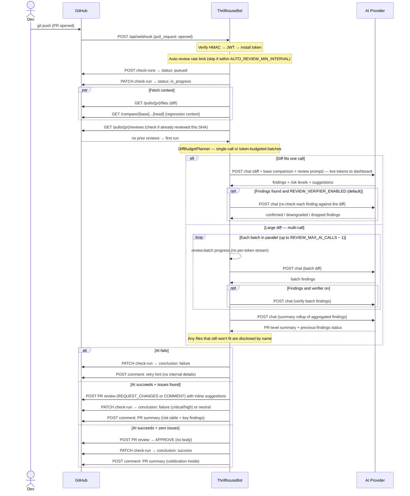
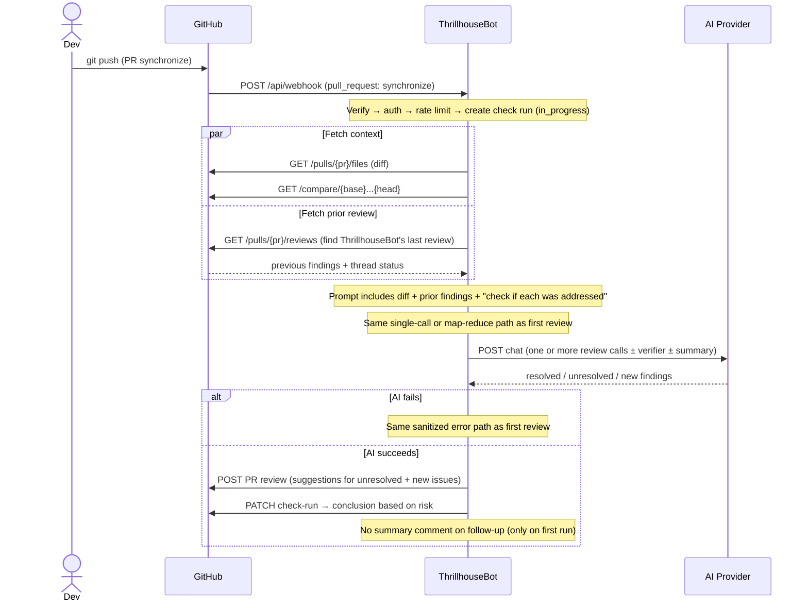
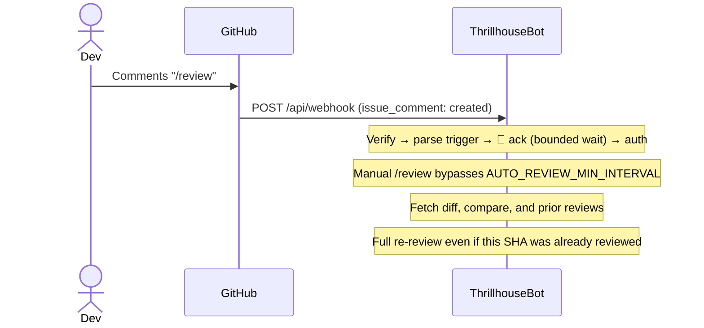
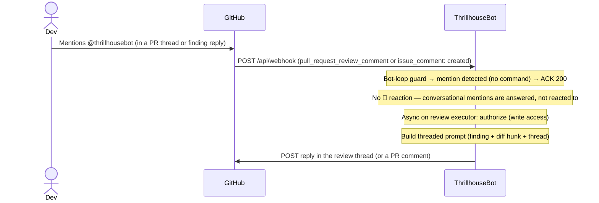

# Architecture
<!-- docs:architecture:start -->

One-page overview of how the bot is structured and how a review flows through it.

ThrillhouseBot is a Quarkus application that runs as a GitHub App. A webhook
arrives when a pull request changes, the bot builds a review with an
OpenAI-compatible model, and it posts the result back as a PR review plus a
check run. A dashboard streams what is happening live.

## Components

```mermaid
flowchart TB
    subgraph GH[GitHub.com]
        IN[PR push, /review, @mention]
        OUT[PR reviews · check runs · comments]
    end

    subgraph BOT[ThrillhouseBot · Quarkus]
        WH[webhook/<br/>WebhookController]
        RO[review/<br/>ReviewOrchestrator]
        AI[review/ai/<br/>AiReviewService]
        GHC[github/<br/>REST clients]
        DB[dashboard/ + frontend/]

        WH --> RO --> AI
        RO --> GHC
        AI -. live tokens / review.batch .-> DB
    end

    IN -->|POST /api/webhook<br/>HMAC-verified| WH
    GHC --> OUT
```

The `github/` clients wrap the GitHub REST surface the bot uses: installation
tokens, pull diffs and prior reviews, check runs, PR reviews with inline
comments, issue comments, and the instructions-file fallback chain
(`.github/thrillhousebot.md`, `.github/copilot-instructions.md`, `CLAUDE.md`,
`AGENTS.md`, `AGENT.md`).

## Request flow

```mermaid
flowchart TD
    GH[GitHub: PR opened / synced / comment] -->|webhook| WH[webhook/]
    WH -->|verify HMAC, filters, rate limit, 👀 ack| RO[review/ ReviewOrchestrator]
    RO -->|fetch diff, instructions, prior findings| GHC[github/ API clients]
    RO -->|budget plan · stream or batch| AI[review/ai/ LangChain4j]
    AI -->|parse findings| RO
    RO -->|verify findings — 2nd AI call per batch, on by default| AI
    RO -->|post review + check run| GHC --> GH
    AI -. live tokens or review.batch .-> DB[dashboard/ broadcaster]
    DB -->|WebSocket| FE[frontend/ Next.js UI]
    RO -->|persist session, cost, tokens| PG[(H2 / PostgreSQL)]
    AI -->|traces, token & cost metrics| OT[(OpenTelemetry)]
```

Automatic triggers (`pull_request` opened / synchronize, and similar) are subject
to `AUTO_REVIEW_MIN_INTERVAL`: if the same PR was auto-reviewed too recently,
the webhook path skips the review silently. Manual `/review` always bypasses that
window. Slash and mention **commands** get a best-effort 👀 reaction before
pause/authorization; conversational `@thrillhousebot` mentions (no command word)
are answered without a reaction.

## Review lifecycle

### First review (PR opened)



### Follow-up review (new push)



### Manual trigger (`/review` or `@Thrillhousebot review`)



### Conversational reply (`@thrillhousebot` mention)



## Packages

| Package | Responsibility | Notable classes |
|---|---|---|
| `webhook/` | Receives GitHub events, verifies the HMAC signature, decides whether an event triggers a review (trigger filters, per-PR pause state, auto-review rate limit), acks slash/mention commands with 👀, and runs the comment commands (`/help`, `/summary`, `/describe`, `/changelog`, `/add-docs`, `/resolve`, `/pause`, `/resume`) | `WebhookController`, `WebhookVerifier`, `TriggerDetector`, `ReviewTriggerFilter`, `AckReactionService`, `CommentCommandService`, `PrPauseService` |
| `review/` | Orchestrates a review: plans the token budget, calls the AI layer (single-call or map-reduce), maps findings to a risk level and review state, writes the summary comment, optionally labels the PR, and answers maintainer replies/mentions in PR threads | `ReviewOrchestrator`, `ReviewDispatcher`, `DiffBudgetPlanner`, `FindingPipeline`, `AutoReviewRateLimiter`, `ReviewDiffFormatter`, `FollowUpAnalyzer`, `PrSummaryGenerator`, `PrLabeler`, `MaintainerReplyService`, `MaintainerReplyDispatcher` |
| `review/ai/` | The LangChain4j layer: streams or batches model responses, parses findings, runs a second pass to verify them, applies generation/reasoning customizers, and writes conversational replies | `PrReviewer`, `AiReviewService`, `ChatModelCustomizers`, `FindingVerifier`, `FindingVerificationService`, `ReviewResponseParser`, `ReplyAssistant` |
| `github/` | Talks to the GitHub REST and GraphQL APIs: app auth, pull requests, reviews, check runs, comments, labels, and reading the repo instructions file | `GitHubAuthClient`, `GitHubReviewClient`, `GitHubCheckRunClient`, `GitHubLabelClient`, `InstructionsResolver` |
| `dashboard/` | The live UI backend: OAuth login (in-memory sessions), WebSocket broadcaster (`review.stream` / `review.batch`), and review session persistence | `AuthResource`, `DashboardSessionStore`, `SessionEventBroadcaster`, `ReviewSessionRepository` |
| `config/` | Wiring: the outbound HTTP client, the review thread pool, typed config, active-model settings (caps, generation params), fail-fast startup validation, and the shared bot-identity used to recognize the bot's own activity | `HttpClientProducer`, `ReviewExecutorProducer`, `ThrillhouseConfig`, `ActiveModelSettings`, `StartupConfigValidator`, `BotIdentity` |
| `frontend/` | The Next.js dashboard, built to a static export and served by Quarkus | — |

## Notes

PR reviews carry inline comments and suggestions; check runs carry pass/fail
status for branch protection (no inline annotations on the check run itself).

**AI call budget** — a review that reports findings makes **two** model calls
by default: the review call plus a skeptical verification pass
(`FindingVerifier`) that re-sends the diff and each candidate finding, dropping
or downgrading what it can't confirm. It fails open — a verifier error keeps
the original findings, so a broken verifier can never block a review. Under
token-aware budgeting on large PRs this becomes N batch review calls + N
per-batch verification calls + one summary call. `REVIEW_VERIFIER_ENABLED=false`
skips only the AI pass (a deterministic hedging-language guard still runs) and
trades cost for more false positives. Expect two model spans per flagged
single-call review (or N+N+1 under budgeting) in the traces and in the
dashboard's session totals. Multi-call reviews do not stream tokens to the
dashboard; they emit `review.batch` progress events instead. Batches run
concurrently on virtual threads; a failed batch is retried once after the
parallel pass completes.

Each AI call is bounded by `AI_TIMEOUT` (LangChain4j) and
`thrillhousebot.review.ai-timeout-seconds`. Cost and token metrics come from
OpenTelemetry. OAuth login sessions are opaque IDs in cookies with tokens kept
server-side; review history persists in the database. See
[SECURITY.md](https://github.com/devops-thiago/ThrillhouseBot/blob/main/SECURITY.md)
for the reporting process.

## Adding an AI provider

There is no provider-specific code. The model is reached through LangChain4j's
OpenAI-compatible client, so a new provider is configuration: point `AI_BASE_URL`
and `AI_MODEL` at it. Add a `thrillhousebot.ai.pricing.<model>.*` pair for cost
tracking (without it the bot warns once and flags sessions as "no pricing"
instead of `$0`). Optionally set `thrillhousebot.ai.models.<model>.*` for the
model's input cap and generation parameters, and `AI_REASONING_ENABLED` /
`AI_REASONING_EFFORT` when the model supports reasoning. See the
[provider table](https://devops-thiago.github.io/ThrillhouseBot/providers/) and
the [configuration reference](https://devops-thiago.github.io/ThrillhouseBot/configuration/).
<!-- docs:architecture:end -->
