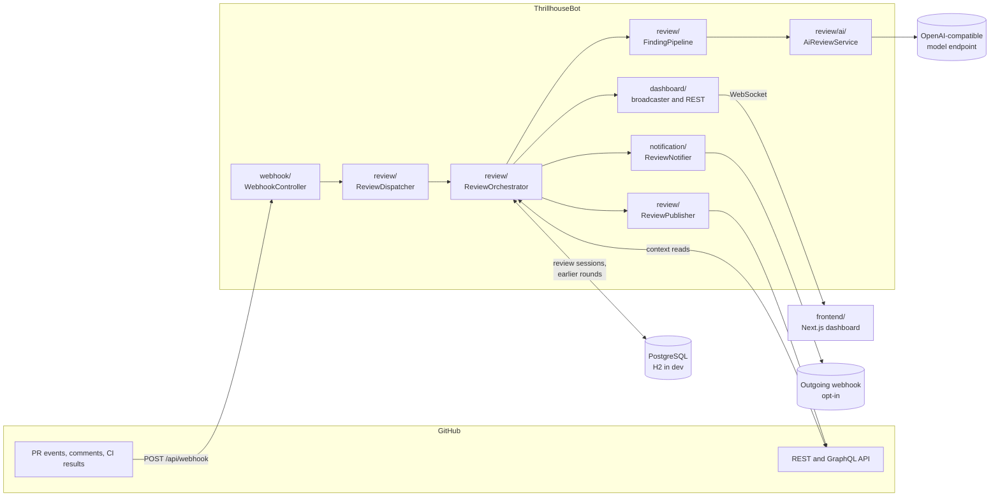
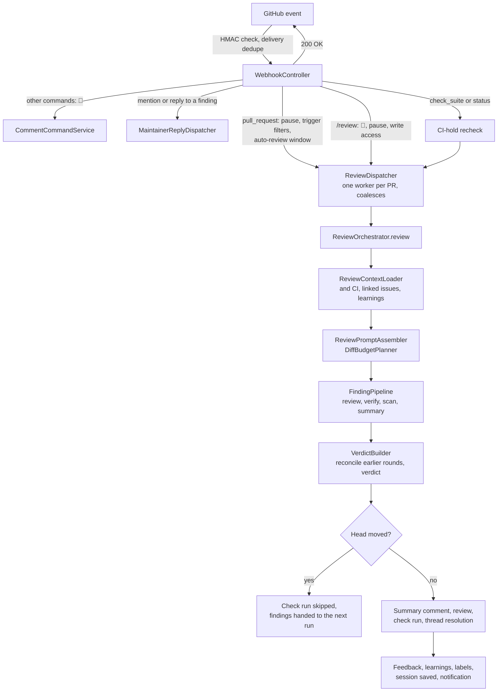
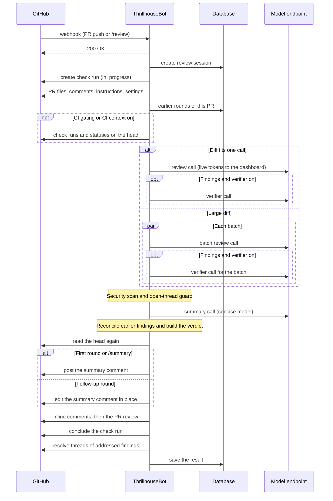
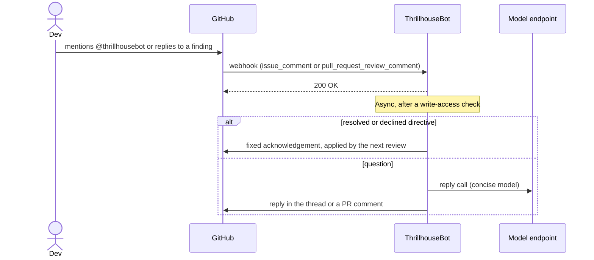

# Architecture
<!-- docs:architecture:start -->

How the bot is put together and what happens between a GitHub event and a posted review.

ThrillhouseBot is a Quarkus application that runs as a GitHub App. GitHub sends a webhook when a
pull request changes or someone comments a command. The bot reviews the change with an
OpenAI-compatible model, posts the result as a PR review, a summary comment and a check run, and
streams progress to a dashboard. Class names below are under
`src/main/java/dev/thiagogonzaga/thrillhousebot/`. The engineering rules behind this design
(invariants, where each stage lives, rejected alternatives) are in
[AGENTS.md](https://github.com/devops-thiago/ThrillhouseBot/blob/main/AGENTS.md).

## Components

```mermaid
flowchart LR
    subgraph GH[GitHub]
        EV[PR events, comments, CI results]
        API[REST and GraphQL API]
    end

    subgraph BOT[ThrillhouseBot]
        WH[webhook/<br/>WebhookController]
        DSP[review/<br/>ReviewDispatcher]
        RO[review/<br/>ReviewOrchestrator]
        FP[review/<br/>FindingPipeline]
        AI[review/ai/<br/>AiReviewService]
        PUB[review/<br/>ReviewPublisher]
        DASH[dashboard/<br/>broadcaster and REST]
        NOTE[notification/<br/>ReviewNotifier]
    end

    LLM[(OpenAI-compatible<br/>model endpoint)]
    DB[(PostgreSQL<br/>H2 in dev)]
    UI[frontend/<br/>Next.js dashboard]
    HOOK[(Outgoing webhook<br/>opt-in)]

    EV -->|POST /api/webhook| WH --> DSP --> RO
    RO --> FP --> AI --> LLM
    RO --> PUB --> API
    RO <-->|context reads| API
    RO <-->|review sessions,<br/>earlier rounds| DB
    RO --> DASH -->|WebSocket| UI
    RO --> NOTE --> HOOK
```

The `github/` clients wrap the GitHub API surface the bot uses: app auth and installation tokens,
pull request files, reviews and review comments, issue comments, check runs, labels, reactions,
thread resolution over GraphQL, the instructions file and the repository settings file.

## Request flow

```mermaid
flowchart TD
    GH[GitHub event] -->|HMAC check, delivery dedupe| WH[WebhookController]
    WH -->|pull_request: pause, trigger filters,<br/>auto-review window| DSP
    WH -->|/review: 👀, pause, write access| DSP
    WH -->|other commands: 👀| CMD[CommentCommandService]
    WH -->|mention or reply to a finding| REP[MaintainerReplyDispatcher]
    WH -->|check_suite or status| CIR[CI-hold recheck]
    WH -->|200 OK| GH
    CIR --> DSP
    DSP[ReviewDispatcher<br/>one worker per PR, coalesces] --> RO[ReviewOrchestrator.review]
    RO --> CTX[ReviewContextLoader<br/>and CI, linked issues, learnings]
    CTX --> PLAN[ReviewPromptAssembler<br/>DiffBudgetPlanner]
    PLAN --> FP[FindingPipeline<br/>review, verify, scan, summary]
    FP --> VB[VerdictBuilder<br/>reconcile earlier rounds, verdict]
    VB --> HM{Head moved?}
    HM -->|yes| SKIP[Check run skipped,<br/>findings handed to the next run]
    HM -->|no| PUB[Summary comment, review,<br/>check run, thread resolution]
    PUB --> POST[Feedback, learnings, labels,<br/>session saved, notification]
```

`WebhookController` verifies the signature, drops a redelivered delivery id, routes the event and
answers 200 before any review work starts. Only cheap gates run on the request thread: the pause
lookup, the trigger filters, the 👀 reaction on a command (bounded by `ACK_REACTION_TIMEOUT`) and
the write-access check for `/review` (bounded by `MANUAL_TRIGGER_AUTH_TIMEOUT`).

| Event | What it starts |
|---|---|
| `pull_request` `opened`, `reopened`, `synchronize`, `ready_for_review` | An automatic review, unless the PR is paused, filtered out by the `WEBHOOK_*` trigger settings (drafts, labels, base branches), or reviewed less than `AUTO_REVIEW_MIN_INTERVAL` ago. `ready_for_review` clears that window. |
| `issue_comment` with `/review` or `@thrillhousebot review` | A manual review. It bypasses the trigger filters and the rate-limit window, and needs write access. |
| `issue_comment` with another command | The command: `/help`, `/summary`, `/describe`, `/changelog`, `/add-docs`, `/improve`, `/generate-tests`, `/resolve`, `/pause`, `/resume`, `/learnings`, `/remember`, `/forget`. `/summary` runs a review that posts a new summary comment. |
| `issue_comment` mentioning the bot without a command | A conversational reply in the PR conversation. No 👀 reaction. |
| `pull_request_review_comment` | A reply in the review thread when it mentions the bot, and finding-feedback capture when it answers a finding. |
| `check_suite` `completed`, `status` | A recheck of any verdict held on pending CI for that commit. |

`ReviewDispatcher` keeps one worker per pull request on the review executor. A request that
arrives while a review of the same PR runs replaces any request already waiting, so only the
newest head is reviewed next. A CI-hold recheck runs once no review of that PR is queued.

## A review, step by step

`ReviewOrchestrator.review` runs one round:

1. Create the `ReviewSession` row and broadcast `review.started`. Register the head with
   `CiHoldRegistry` and create the "ThrillhouseBot Review" check run as `in_progress`, linked to
   the session on the dashboard.
2. Load the context (`ReviewContextLoader.load`):
   - the PR files, filtered by the deployment's and the repository's ignore globs;
   - `.github/thrillhousebot.yml` (ignore globs and path-scoped instructions);
   - every earlier round of this PR, read back from the stored `ReviewSession` responses;
   - on a follow-up, the review comments and the PR conversation;
   - the instructions file (the first of `.github/thrillhousebot.md`,
     `.github/copilot-instructions.md`, `CLAUDE.md`, `AGENTS.md`, `AGENT.md`), existing labels,
     project stack, linked bug-fix issue text, config-key definitions and, when enabled, patch
     coverage.
3. Read the opt-in context sections: CI failures (`CiFailureContextResolver`), linked issues
   (`TicketContextResolver`) and review learnings (`ReviewLearnings.promptSection`).
4. Assemble the prompt inputs (`ReviewPromptAssembler.assemble`) and plan the calls
   (`DiffBudgetPlanner.plan`). The CI reading for the verdict runs in parallel: from step 2 when CI
   context is on, from here otherwise.
5. Run the model calls and the finding chain (`FindingPipeline.run`).
6. Read CI again if the first reading would hold approval, then build the verdict
   (`VerdictBuilder.build`).
7. Read the PR head again. If it moved during the round, mark the check run `skipped`, hand the
   verified findings to the run queued for the new head (`SupersededFindingsCarryover`) and stop.
8. Publish the summary comment, the optional delta comment and the PR review, then conclude the
   check run.
9. Run the post-result steps. Each may fail without undoing the review: resolve the threads of
   addressed findings, capture finding feedback, capture review learnings, apply or suggest labels,
   save the session and broadcast `review.completed`, send the outcome notification.

A failure before anything was published marks the check run `failure` and posts a short notice on
the PR. For a cut response or a context-window rejection the notice names the cap and the setting
to change; otherwise it suggests `/review`. The session is saved as failed and the failure
notification is sent.

```mermaid
sequenceDiagram
    participant GH as GitHub
    participant TB as ThrillhouseBot
    participant DB as Database
    participant AI as Model endpoint

    GH->>TB: webhook (PR push or /review)
    TB-->>GH: 200 OK
    TB->>DB: create review session
    TB->>GH: create check run (in_progress)
    TB->>GH: PR files, comments, instructions, settings
    TB->>DB: earlier rounds of this PR
    opt CI gating or CI context on
        TB->>GH: check runs and statuses on the head
    end

    alt Diff fits one call
        TB->>AI: review call (live tokens to the dashboard)
        opt Findings and verifier on
            TB->>AI: verifier call
        end
    else Large diff
        par Each batch
            TB->>AI: batch review call
            opt Findings and verifier on
                TB->>AI: verifier call for the batch
            end
        end
    end
    Note over TB: Security scan and open-thread guard
    TB->>AI: summary call (concise model)
    Note over TB: Reconcile earlier findings and build the verdict

    TB->>GH: read the head again
    alt First round or /summary
        TB->>GH: post the summary comment
    else Follow-up round
        TB->>GH: edit the summary comment in place
    end
    TB->>GH: inline comments, then the PR review
    TB->>GH: conclude the check run
    TB->>GH: resolve threads of addressed findings
    TB->>DB: save the result
```

## Model calls

A review normally makes at least two model calls: one or more review calls, then one summary call.
Each review call that returned findings adds a verifier call.

| Lane | When | Calls |
|---|---|---|
| Single call | The reviewable diff fits one call | Review call, verifier call if it found anything, summary call |
| Multi call | Token budgeting split the diff into batches | One review call per batch, in parallel; one verifier call per batch with findings; one summary call |
| Summary only | Every reviewable file was over the per-call budget or had no patch text | The summary call only. The files are disclosed by name. |

Token budgeting is on whenever `REVIEW_MAX_INPUT_TOKENS` is above `0` (default `48000`).
`DiffBudgetPlanner` then packs files into at most `REVIEW_MAX_AI_CALLS` − 1 batches (default 6
calls) and reserves one call for the summary. At `REVIEW_MAX_AI_CALLS=1` the single-call lane skips
the summary call and says so in the summary.

The review call (`PrReviewer`) returns findings and the status of each earlier finding, nothing
else. The summary call (`PrSummarizer`) writes every summary field (purpose, description gaps, file
walkthrough, labels, diagram) from the verified findings and the changed-file list. The summary,
the verifier and the conversational replies run on the `concise` model binding, with their own
output cap (`REVIEW_CONCISE_MAX_OUTPUT_TOKENS`, default 8192) and reasoning setting.

Review and summary calls stream from the provider. Only the single-call review streams tokens to
the dashboard; a batch emits `review.batch` progress events instead. Batches run on virtual
threads. A batch that failed for a reason other than a cut response, a context-window rejection or
the spend ceiling is retried once, one batch at a time, after the parallel pass.

A failed call attempt is retried with backoff, up to `thrillhousebot.review.max-ai-retries`
attempts (default 5). A response cut at its length cap is not retried, because the same call would
be cut the same way: the findings completed before the cut are kept and the affected files are
disclosed. A length stop with no content (reasoning used the whole cap) is repeated once with
reasoning off. Each call is bounded by `AI_TIMEOUT` (default 300 s).

`AI_MAX_CONCURRENT_CALLS` caps model calls in flight across the process (default `0`, no cap); a
call past the cap waits for a slot. `REVIEW_MAX_TOKENS_PER_REVIEW` caps the tokens one review may
spend across all its calls, retries, verifier and summary included (default `0`, no cap). Once it
is reached, the remaining batches are disclosed as not reviewed and the summary falls back to
counts.

## The finding chain

`FindingPipeline` runs the model's findings through a fixed chain before anything is published.

On the single-call lane (`FindingPipeline.refine`), in order:

1. Attach evidence for findings that cite code outside the diff (`ReviewEvidence`).
2. Check that quoted code exists (`FindingQuoteValidator`).
3. Drop known framework false positives (`FrameworkFalsePositiveFilter`).
4. Merge duplicates (`FindingDeduplicator`).
5. Drop what the verifier already rejected on this head (`VerifierRejectionMemory`).
6. Verify (`FindingVerificationService`).
7. Calibrate severity (`SeverityCalibrator`).
8. Drop restatements of findings a maintainer already answered, and of findings argued out on
   earlier rounds.
9. Fill missing code anchors.

On the multi-call lane each batch runs steps 1, 2, 3, 5 and 6 in its own thread. Once every batch
has finished, the pipeline merges the statuses the batches reported and runs steps 4, 8 and 9 over
the combined findings. Severity calibration does not run on this lane.

Every lane then ends with the same two steps (`FindingPipeline.finish`): the deterministic security
scan merge, then the guard that drops a new finding restating one still open on its own thread
from any earlier round. The summary call runs after that. Carried description gaps are merged
into its result, prompt vocabulary is scrubbed from the response (`PromptLabelScrubber`) and the
response is stored on the session.

### Verification

The verifier (`FindingVerifier`, on the concise model) gets the diff and each candidate finding,
and confirms, downgrades or drops it. It is on by default (`REVIEW_VERIFIER_ENABLED`). Before the
call, a deterministic pass drops findings that retract themselves and demotes hedged blocking
claims. That pass still runs with the verifier off.

Verification fails open. An error, an empty or cut response, or a call skipped at the spend
ceiling keeps the candidates. Those findings are capped at medium confidence and say in their text
that they were not verified, so under the default blocking strictness they cannot request changes
on their own. The summary states how much of the round was verified (`VerificationCoverage`).

### Deterministic security scan

With `REVIEW_SECRET_SCAN_ENABLED` or `REVIEW_IAC_SCAN_ENABLED` (both off by default),
`SecurityScan.merge` reads the added lines of every reviewable file (`PatchLines`) with a fixed
rule list. `SecretScanner` matches credential formats, private keys, JWTs and credential-named
assignments whose value passes an entropy threshold (`REVIEW_SECRET_SCAN_ENTROPY_THRESHOLD`,
default 3.5). `IacScanner` matches admin ports open to the internet, public S3 buckets, wildcard
IAM, privileged pods, host namespaces, a final Dockerfile stage running as root and disabled
encryption. `SecurityRule` holds each rule's severity and title. A `thrillhousebot:allow-secret` or
`thrillhousebot:allow-iac` comment on the line or the line above suppresses a match, and
`REVIEW_SECURITY_SCAN_SKIPPED_FILES` excludes fixture paths.

The merge runs after verification, so no model grades a pattern match and the verifier's
fail-open marking never applies to one. A model finding that reports the same defect nearby is
dropped in favour of the scan's. Every matched value is replaced in the remaining findings, status
notes and summary before anything is stored or posted. A secret finding shows only the value's
first characters and length and carries no code anchor, so the value reaches no comment, log line,
stored session or dashboard view.

The scan also tracks its own findings across rounds:

- A detection that matches a scan finding still open from an earlier round is not raised again.
  The scan reports that finding `unresolved` while it still matches and `resolved` once it does
  not.
- A detection that matches a scan finding a maintainer declined (a round recorded it `justified`)
  is not raised again while the content is the same: same file, title and anchor, and for a secret
  the same line, compared through a short hash kept in a hidden `thrillhousebot:scan-content`
  marker in the finding's text. A new value on that line is raised again.

## Follow-up rounds

A round is a follow-up when an earlier round of the PR was stored. The stored responses are the
source of truth, not the text of the bot's earlier reviews.

### What the model is shown

Finding ids come from one round: the newest earlier round that raised any findings. Its findings
are listed by number with their thread replies, and the model reports a status for each:
`resolved`, `unresolved` or `justified`. Findings a newer round already settled are left out.

Findings the rounds before that one left open, each on its own thread, are listed in a separate
unnumbered section that the model is told not to raise again or report on. Findings from older
rounds that a maintainer answered are listed the same way. Without these sections, a round after
one that raised something new would see the older open findings as never reported and post them
again.

### Reconciling statuses

`VerdictBuilder.build` turns the model's statuses into the round's final statuses, in this order:

1. A finding whose targeted code left the diff becomes `superseded`, unless the head is the one the
   finding was raised on.
2. A maintainer's decline is a claim, not ground truth (`REVIEW_DECLINE_RECHECK_ENABLED`, on by
   default). When the only write-access reply on a thread rests on a premise the reviewed code
   contradicts, the finding goes back to `unresolved` for one more round. A second reply always
   stands. A finding without a thread is declined or cleared from the PR conversation with
   `@thrillhousebot declined <path>:<line> — <title>` or
   `@thrillhousebot resolved <path>:<line> — <title>`.
3. An `unresolved` id that is repeated or names no finding is dropped, so nothing is counted twice.
4. A "Things to double-check" item (a low-confidence medium or low finding, listed in the summary
   without a thread) is replaced when this round or a later one raises the same defect at the same
   or higher severity. Same defect means the same file and either the same title, a similar title
   within three lines, or the same line with shared title words or a common identifier. Two titles
   that name different identifiers are never the same defect.
5. The approval backstop replays every earlier round, oldest first. It keeps open each finding that
   no round closed and the model did not report on, as long as its code is still in the diff. A
   decline on a finding from an older round is weighed as in step 2: the finding stays open when
   the decline is contradicted or rests on an unconfirmed premise, and otherwise counts as
   justified without holding anything open.

The still-open set is the `unresolved` findings plus the backstop's holds, one entry per finding.
That one set feeds the summary's counts and lists, the "Still present" count and the verdict.

### The summary comment

The summary is one comment per pull request, marked with `<!-- thrillhousebot:summary -->`. The
first round posts it. Every later round finds the newest bot comment carrying the marker (or, for
summaries posted before 0.7.0, the summary heading) and replaces its body. An unchanged body is
not rewritten. A new comment is posted when the old one was deleted or the edit failed, and when
`/summary` asks for one.

Because the edit replaces the whole body, each round renders the PR as it stands. The risk counts,
Key Findings and "Things to double-check" cover the round's new findings plus every earlier finding
still open, tagged as open since an earlier review. Description gaps the previous summary listed
are passed to the summary call (`DescriptionGapCarryover`). They stay listed until the call says
they are addressed, the round reports them again, or their issue is no longer linked. When the
summary call returns no overview on an unchanged head, the previous round's overview is reused
(`PriorOverviewCarryover`).

The comment keeps no history of its own. Each round's review and inline comments record that
round, and the optional delta comment (`REVIEW_FOLLOW_UP_SUMMARY_ENABLED`, off by default) lists
what changed since the last round.

### Threads

After the review is posted, `ReviewPublisher.resolveAddressedThreads` resolves the review thread of
every finding of the reported round whose final status is `resolved` or `justified`. A finding
cleared from the PR conversation gets a short reply on its thread first.

## Verdict and check run

The review state is computed over this round's findings plus the still-open set, so an earlier
critical finding that is still open requests changes even when every new finding is low.

| State | When | Check run |
|---|---|---|
| `REQUEST_CHANGES` | A finding blocks under `REVIEW_BLOCKING_STRICTNESS` | `failure` |
| `COMMENT` | Findings remain but none blocks, or APPROVE was held back | `neutral` |
| `APPROVE` | Nothing open and nothing held it back | `success` |

`REVIEW_BLOCKING_STRICTNESS` decides what blocks: `balanced` (default) blocks on a critical or high
finding with high confidence, `strict` on any critical or high finding, `lenient` only on a
critical finding with high confidence. APPROVE drops to COMMENT when an earlier finding is still
`unresolved`, when files went unreviewed, or when CI holds it.

`REVIEW_CI_GATING` decides how CI counts. `strict` (default) holds approval while a required check
is pending, failing, missing or unreadable; `warn` approves and notes the CI state; `off` ignores
CI. When pending CI was the only thing between the round and APPROVE, the verdict is held in
`CiHoldRegistry` and the check run ends `neutral`. The `check_suite` or `status` event that reports
the head green then posts the approval (`CiHoldRevisit`) without another model call.

A follow-up round with no new findings but earlier findings still open says how many remain
unresolved rather than calling the PR clean. Findings are posted as individual inline comments, with a committable
suggestion where the range resolves. A comment GitHub refuses is retried without the suggestion,
then as a file-level comment. Low-confidence medium and low findings go to the summary's "Things to
double-check" list instead. At most `thrillhousebot.review.max-review-comments` (default 50)
findings are posted inline.

## Context sections

These sections ride the review call's trailing guidance, fenced as untrusted data, so every batch
carries them and `DiffBudgetPlanner` counts them as shared overhead. The summary and verifier
calls do not get them unless stated. All are off by default.

| Section | Setting | Source |
|---|---|---|
| Patch coverage | `REVIEW_PATCH_COVERAGE_ENABLED` | `PatchCoverageResolver` reads the CI coverage report and lists the changed lines no test covers. |
| CI failures | `REVIEW_CI_CONTEXT_ENABLED` | `CiStatusEvaluator`'s early reading of the head. `CiFailureContextResolver` renders the failing checks, one annotations page each, plus a job-log tail with `REVIEW_CI_CONTEXT_INCLUDE_LOGS`. Pending checks contribute a count only. |
| Linked issues | `REVIEW_TICKET_CONTEXT_ENABLED` | `TicketContextResolver` over `GitHubIssuesProvider`: PR-body closing keywords, then GitHub's closing references, then optionally the branch name. Same-repository issues only, read and never written. The summary call gets it too and lists unaddressed acceptance criteria as description gaps, never as findings. |
| Review learnings | `REVIEW_LEARNINGS_ENABLED` | `ReviewLearnings` ranks the repository's active learnings by how close their file is to the changed files, and caps them in count and characters. |

Learnings are captured after a review is posted. `FollowUpAnalyzer.survivingDeclines` keeps only
the `justified` findings whose decline the re-check ran against and whose every reason rests on no
premise the code could refute. The author's write access is confirmed before
`ReviewLearningService` writes a `review_learning` row, scoped to the installation and repository,
and `LearningText` refuses credential-shaped text. `/learnings`, `/remember` and `/forget` list,
add and retract rows. Retracting only clears `active`, so the dashboard's audit view keeps the
history.

### Review dimension routing

The review call's system prompt (`PrReviewPrompts`) is a core plus ten dimension blocks.
Correctness, security and regressions are always on. With `REVIEW_DIMENSION_ROUTING_ENABLED` off,
the default, every call carries all ten. With it on, `ReviewDimensionRouter` picks each call's
blocks from its files' kinds (documentation, configuration or infrastructure, script, source,
test) and two probes over the patch (API or list code, mocks or stubs). An unrecognized file type
brings every block in. The core comes first, so it is the prefix a provider's prompt cache can
match across calls. The verifier routes its own carve-outs by the files its candidates are in.

### Repository configuration

`.github/thrillhousebot.yml` holds a repository's own ignore globs and path-scoped review
instructions, read from the default branch and cached for five minutes. Its ignore globs add to the
deployment's list: a repository can narrow its review scope but cannot bring back a file the
deployment excludes. A missing or invalid file is logged and skipped. A glob that matched nothing
is disclosed in the summary.

## Coverage disclosures

A file the review never read does not pass silently. A file with no patch text, a file that fit no
batch, a file skipped at the spend ceiling and a file whose batch failed are named in the summary
and withhold APPROVE. A cut response keeps the findings completed before the cut. A summary call
that fails, is cut, or is skipped at a cap leaves a counts-only summary that says so.

## Concurrency and in-memory state

Reviews, CI rechecks, comment commands, replies and notification deliveries share one
virtual-thread executor with no size limit. Load is bounded by per-PR serialization in
`ReviewDispatcher`, the model call cap and GitHub write pacing.

| Limit | Setting | Default |
|---|---|---|
| Model calls in flight, process-wide (`ModelCallGate`) | `AI_MAX_CONCURRENT_CALLS` | `0` (no cap) |
| Planned calls per review | `REVIEW_MAX_AI_CALLS` | `6` |
| Tokens per review (`ReviewTokenLedger`) | `REVIEW_MAX_TOKENS_PER_REVIEW` | `0` (no cap) |
| Spacing between content-creating GitHub writes, and the longest wait (`GitHubWritePacer`) | `GITHUB_WRITE_MIN_INTERVAL`, `GITHUB_WRITE_MAX_WAIT` | `1s`, `90s` |

The following state lives in memory, per process, and is lost on restart:

| State | Effect of losing it |
|---|---|
| Per-PR queue and coalescing (`ReviewDispatcher`) | A queued review does not run; the next push or `/review` starts one. |
| Verdicts held on CI (`CiHoldRegistry`, up to 256 PRs) | The approval is not posted when CI turns green; `/review` posts it. |
| Findings handed over by a superseded run (`SupersededFindingsCarryover`) | The next round finds them again from the diff. |
| Verifier rejections per head (`VerifierRejectionMemory`) | A rejected finding can go through the verifier again. |
| Webhook delivery ids (24 h) and the auto-review window | A redelivery or an early push can be reviewed. |
| Dashboard login sessions (8 h) | Users log in again. |
| Caches: installation tokens, instructions file, repository settings, project stack, dashboard access | Read again from GitHub. |

The summary comment is found by its marker each round, not by an id held in memory, so a restart
does not lose it. On startup `InterruptedSessionReconciler` marks every session still
`in_progress` as failed. The bot is designed to run as a single replica.

## Persistence

| Entity | Table | Holds |
|---|---|---|
| `ReviewSession` | `ReviewSession` | One row per review round: PR, head commit, model, tokens, cost, duration, finding counts, status, and the final response (`aiResponseJson`) that later rounds read their earlier findings from. |
| `PausedPr` | `PausedPr` | PRs paused with `/pause`. |
| `FindingFeedback` | `finding_feedback` | 👍/👎 reactions and reply signals on findings. See [Finding feedback](https://devops-thiago.github.io/ThrillhouseBot/feedback/). |
| `ReviewLearning` | `review_learning` | Review learnings, scoped to installation and repository. A retracted row stays, with `active` cleared. |

Production uses PostgreSQL (`DATABASE_URL`); dev mode uses in-memory H2. There are no migration
scripts: Hibernate updates the schema in production and drops and recreates it in dev.

## Dashboard and notifications

The dashboard backend (`dashboard/`) serves the Next.js static export under `/dashboard/`, a
GitHub OAuth login whose tokens stay on the server, REST endpoints under `/api/dashboard`
(sessions, costs, tokens, feedback, learnings, summary) and a WebSocket at `/ws/dashboard`. The
WebSocket carries `review.started`, `review.stream`, `review.batch`, `review.progress`,
`review.retry`, `review.completed` and `review.failed` events, and replays an active session's
events to a client that connects late. Check runs link to `/session/<id>`, which redirects to the
session page.

With `NOTIFICATIONS_WEBHOOK_URL` set, `ReviewNotifier` posts each final outcome (completed or
failed) once, as JSON, Slack or Discord, off the review thread. Requests can be signed with
HMAC-SHA256 and are retried on timeouts, 429 and 5xx. A superseded run and the approval posted
when held CI turns green send nothing.

Traces, token counts and cost come from OpenTelemetry. Security reports follow
[SECURITY.md](https://github.com/devops-thiago/ThrillhouseBot/blob/main/SECURITY.md).

## Conversational replies

```mermaid
sequenceDiagram
    actor Dev
    participant GH as GitHub
    participant TB as ThrillhouseBot
    participant AI as Model endpoint

    Dev->>GH: mentions @thrillhousebot or replies to a finding
    GH->>TB: webhook (issue_comment or pull_request_review_comment)
    TB-->>GH: 200 OK
    Note over TB: Async, after a write-access check
    alt resolved or declined directive
        TB->>GH: fixed acknowledgement, applied by the next review
    else question
        TB->>AI: reply call (concise model)
        TB->>GH: reply in the thread or a PR comment
    end
```

`REVIEW_CONVERSATIONAL_REPLIES_ENABLED` (default on) controls these replies. A thread reply sends
the model the finding, its diff hunk and the thread. A mention in the PR conversation sends the
diff, filtered by the ignore globs.

## Packages

| Package | Responsibility | Notable classes |
|---|---|---|
| `webhook/` | Receives events, verifies the signature, drops redeliveries, applies trigger filters, pause state and the auto-review window, acks commands with 👀, routes commands and replies, starts CI-hold rechecks | `WebhookController`, `WebhookVerifier`, `WebhookDeduplicator`, `TriggerDetector`, `ReviewTriggerFilter`, `ManualReviewAuthorizer`, `AckReactionService`, `CommentCommandService`, `LearningCommands`, `PrPauseService` |
| `review/` | Everything from "a review was requested" to "the result is on GitHub": dispatch, context, prompt assembly, budgeting, the finding chain, the security scan, follow-up reconciliation, verdict, publishing, CI gating, learnings, replies and the on-request commands | `ReviewDispatcher`, `ReviewOrchestrator`, `ReviewContextLoader`, `ReviewPromptAssembler`, `DiffBudgetPlanner`, `FindingPipeline`, `SecurityScan`, `FollowUpAnalyzer`, `VerdictBuilder`, `ReviewPublisher`, `PrSummaryGenerator`, `CiStatusEvaluator`, `CiHoldRevisit`, `TicketContextResolver`, `ReviewLearnings`, `MaintainerReplyService` |
| `review/ai/` | The LangChain4j layer: AI service interfaces and prompts, streaming and retries, response parsing and salvage, the verifier, the token ledger and the call gate | `AiReviewService`, `PrReviewer`, `PrSummarizer`, `FindingVerifier`, `FindingVerificationService`, `ReviewResponseParser`, `ReplyAssistant`, `ModelCallGate`, `ReviewTokenLedger` |
| `github/` | GitHub REST and GraphQL clients, app auth, write pacing and retry, the instructions file and repository settings | `GitHubAuthClient`, `GitHubReviewClient`, `GitHubCheckRunClient`, `GitHubWritePacer`, `GitHubWriteRetry`, `InstructionsResolver`, `RepoSettingsResolver`, `ReviewThreadService` |
| `dashboard/` | OAuth sessions, the WebSocket broadcaster, review session persistence, dashboard REST | `AuthResource`, `DashboardResource`, `SessionEventBroadcaster`, `ReviewSession`, `ReviewSessionPersistence`, `InterruptedSessionReconciler` |
| `notification/` | The opt-in outgoing review-outcome webhook | `ReviewNotifier`, `NotificationSettings`, `NotificationPayloads`, `WebhookDelivery` |
| `config/` | Typed configuration, startup validation, the review executor, the HTTP client, model settings, bot identity | `ThrillhouseConfig`, `StartupConfigValidator`, `ReviewExecutorProducer`, `ActiveModelSettings`, `BotIdentity` |
| `frontend/` | The Next.js dashboard, built to a static export and served by Quarkus | — |

## Adding an AI provider

There is no provider-specific code. The model is reached through LangChain4j's OpenAI-compatible
client, so a new provider is configuration: point `AI_BASE_URL` and `AI_MODEL` at it. Add a
`thrillhousebot.ai.pricing.<model>.*` pair for cost tracking (without it the bot warns once and
marks sessions "no pricing" instead of `$0`). Optionally set `thrillhousebot.ai.models.<model>.*`
for the model's input cap and generation parameters, and `AI_REASONING_ENABLED` /
`AI_REASONING_EFFORT` when the model supports reasoning. See the
[provider table](https://devops-thiago.github.io/ThrillhouseBot/providers/) and the
[configuration reference](https://devops-thiago.github.io/ThrillhouseBot/configuration/).
<!-- docs:architecture:end -->
