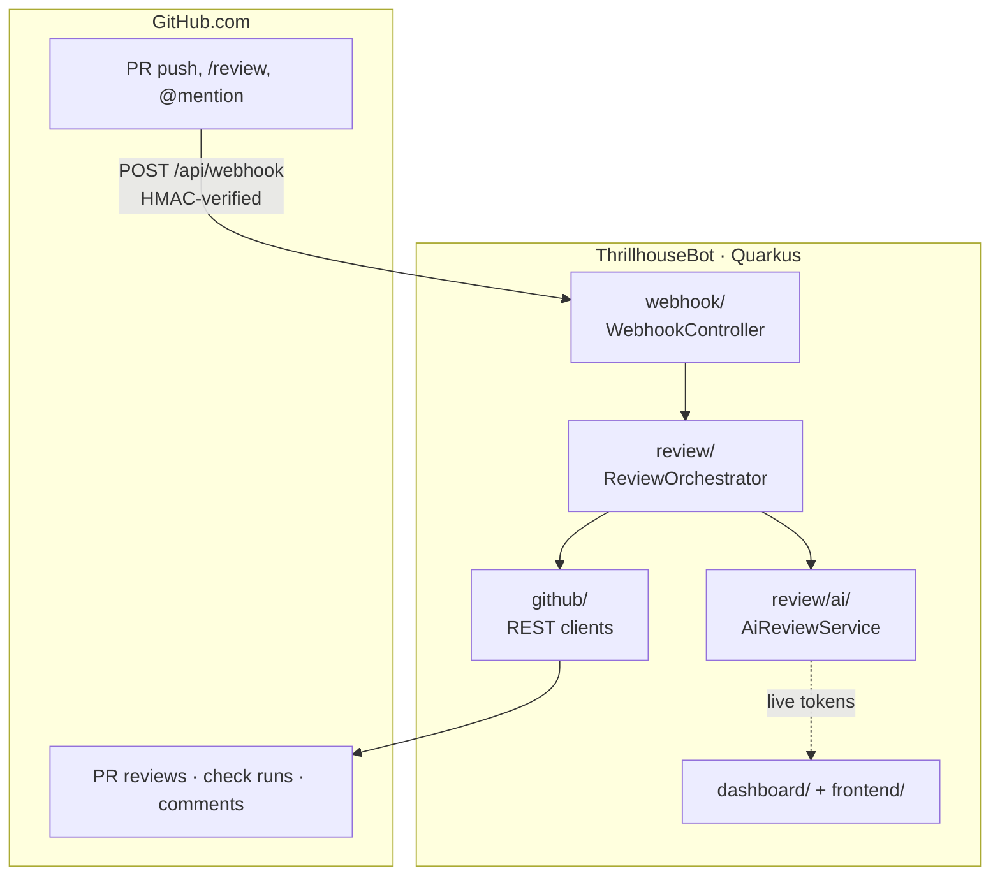
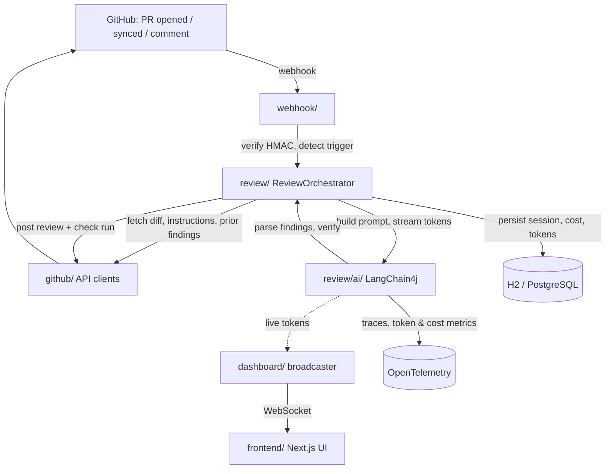
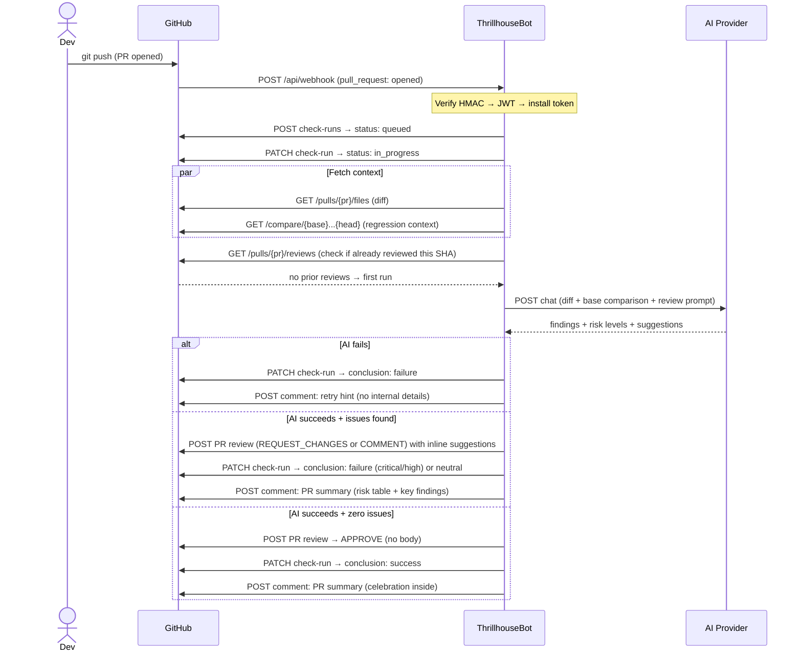
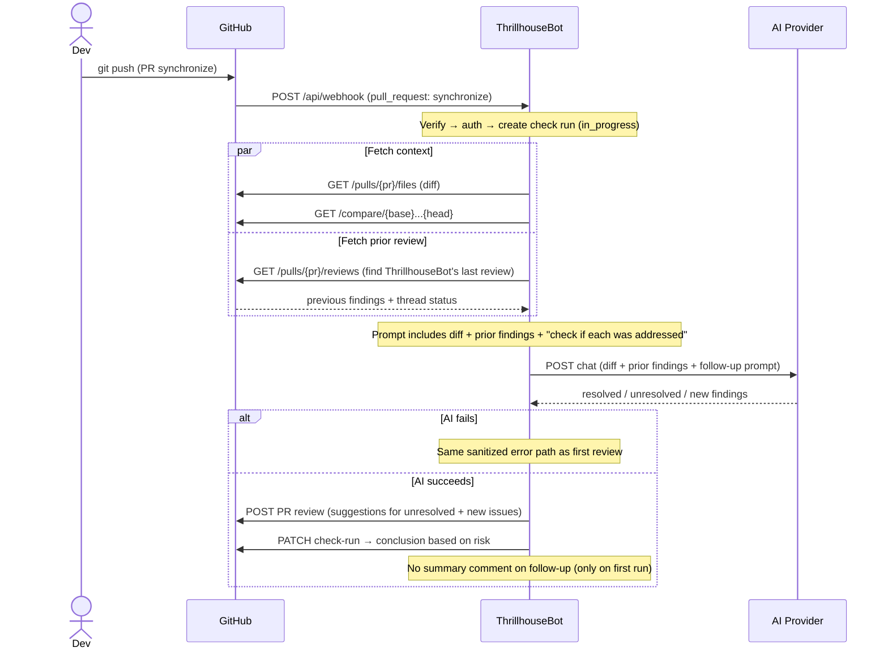
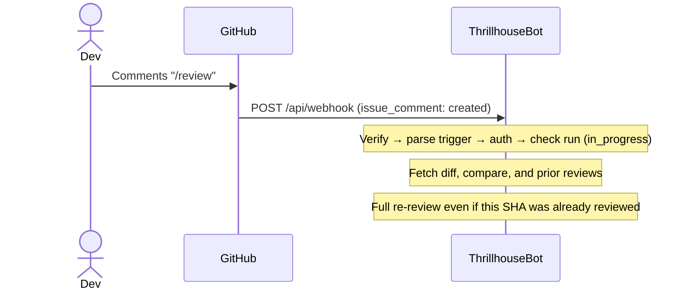

One-page overview of how the bot is structured and how a review flows through it.

ThrillhouseBot is a Quarkus application that runs as a GitHub App. A webhook
arrives when a pull request changes, the bot builds a review with an
OpenAI-compatible model, and it posts the result back as a PR review plus a
check run. A dashboard streams what is happening live.

## Components

The `github/` clients wrap the GitHub REST surface the bot uses: installation
tokens, pull diffs and prior reviews, check runs, PR reviews with inline
comments, issue comments, and the instructions-file fallback chain
(`.github/thrillhousebot.md`, `.github/copilot-instructions.md`, `CLAUDE.md`,
`AGENTS.md`, `AGENT.md`).

## Request flow

## Review lifecycle

### First review (PR opened)

### Follow-up review (new push)

### Manual trigger (`/review` or `@Thrillhousebot review`)

## Packages

| Package | Responsibility | Notable classes |
|---|---|---|
| `webhook/` | Receives GitHub events, verifies the HMAC signature, decides whether an event triggers a review | `WebhookController`, `WebhookVerifier`, `TriggerDetector` |
| `review/` | Orchestrates a review: formats the diff, calls the AI layer, maps findings to a risk level and review state, writes the summary comment | `ReviewOrchestrator`, `ReviewDispatcher`, `ReviewDiffFormatter`, `FollowUpAnalyzer`, `PrSummaryGenerator` |
| `review/ai/` | The LangChain4j layer: streams the model response, parses it into findings, and runs a second pass to verify them | `PrReviewer`, `AiReviewService`, `FindingVerifier`, `FindingVerificationService`, `ReviewResponseParser` |
| `github/` | Talks to the GitHub REST and GraphQL APIs: app auth, pull requests, reviews, check runs, comments, and reading the repo instructions file | `GitHubAuthClient`, `GitHubReviewClient`, `GitHubCheckRunClient`, `InstructionsResolver` |
| `dashboard/` | The live UI backend: OAuth login (in-memory sessions), WebSocket broadcaster, and review session persistence | `AuthResource`, `DashboardSessionStore`, `SessionEventBroadcaster`, `ReviewSessionRepository` |
| `config/` | Wiring: the outbound HTTP client, the review thread pool, and typed config | `HttpClientProducer`, `ReviewExecutorProducer`, `ThrillhouseConfig` |
| `frontend/` | The Next.js dashboard, built to a static export and served by Quarkus | — |

## Notes

PR reviews carry inline comments and suggestions; check runs carry pass/fail
status for branch protection (no inline annotations on the check run itself).

Each AI call is bounded by `AI_TIMEOUT` (LangChain4j) and
`thrillhousebot.review.ai-timeout-seconds`. Cost and token metrics come from
OpenTelemetry. OAuth login sessions are opaque IDs in cookies with tokens kept
server-side; review history persists in the database. See [SECURITY.md](https://github.com/devops-thiago/ThrillhouseBot/blob/v0.1.1/SECURITY.md)
for the reporting process.

## Adding an AI provider

There is no provider-specific code. The model is reached through LangChain4j's
OpenAI-compatible client, so a new provider is configuration: point `AI_BASE_URL`
and `AI_MODEL` at it, and add a `thrillhousebot.ai.pricing.<model>.*` pair if you
want cost tracking for that model. See the provider table in the
[README](/ThrillhouseBot/0.1.1/providers).
