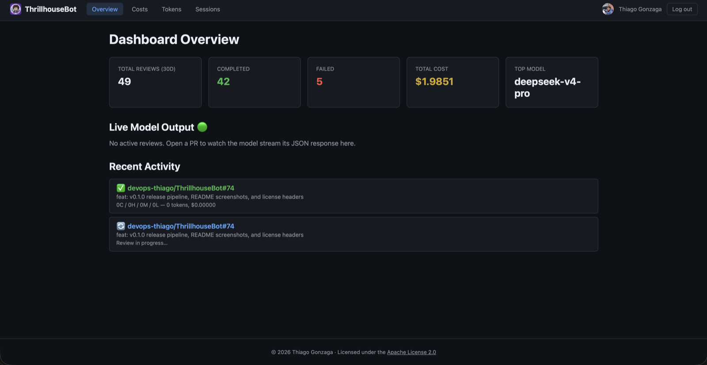

> **"Everything's coming up Thrillhouse!"**

A self-hosted, GraalVM-native PR review bot, built as a GitHub App with Quarkus.
Documentation snapshot for **v0.1.1**.

## Features

- Reviews diffs for correctness, security, regressions, stale comments, and code quality
- Inline code suggestions on review comments that you can apply with one click
- Every finding is tagged `critical`, `high`, `medium`, or `low`
- Follow-up reviews track whether earlier findings were addressed or justified
- A summary comment on the first run, with a risk breakdown
- Live dashboard (Next.js) with a WebSocket activity feed, cost charts, and token tracking
- OpenTelemetry traces, token histograms, cost counters, and latency metrics
- Reads per-repo instructions from `.github/thrillhousebot.md`, falling back to Copilot/Claude/Agents files
- Compiles ahead-of-time with GraalVM/Mandrel, so it starts fast and stays small

## Where to go next

- **[Getting started](/ThrillhouseBot/0.1.1/getting-started)** — create the GitHub App and run the bot
- **[Configuration](/ThrillhouseBot/0.1.1/configuration)** — environment variables and defaults
- **[AI providers](/ThrillhouseBot/0.1.1/providers)** — OpenAI-compatible endpoints
- **[Architecture](/ThrillhouseBot/0.1.1/architecture)** — how a review flows through the system
- **[How it compares](/ThrillhouseBot/0.1.1/comparison)** — vs other AI code-review tools
- **[Contributing](/ThrillhouseBot/0.1.1/contributing)** — development setup

## Dashboard

The built-in dashboard shows summary cards, a live activity feed, cost charts,
token breakdowns, and session history:

