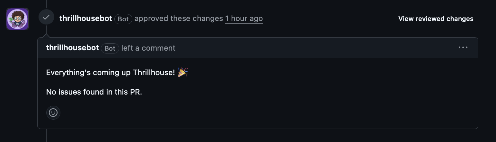

> **"Everything's coming up Thrillhouse!"**

A self-hosted, GraalVM-native PR review bot, built as a GitHub App with Quarkus.
It reviews pull requests using any OpenAI-compatible chat API, so the review is
language-agnostic and you can pick the provider that suits you — including a
local Ollama model, so no code has to leave your network.

## Features

- Reviews diffs for correctness, security, regressions, stale comments, and code quality
- Token-budgeted whole-PR review for large diffs — split into parallel map-reduce batches with omitted files named, not silently dropped
- Configurable auto-review triggers — skip drafts, gate on labels, or filter by base branch — plus an optional per-PR auto-review interval (`AUTO_REVIEW_MIN_INTERVAL`) when you want to cap spend on noisy PRs (off by default; use `/pause` to silence a PR)
- Inline code suggestions on review comments that you can apply with one click
- Every finding is tagged `critical`, `high`, `medium`, or `low`
- Follow-up reviews track whether earlier findings were addressed or justified
- Maintainer 👍/👎 (and "not useful" replies) on finding comments are recorded for a future learnings pipeline — see [Finding feedback](https://devops-thiago.github.io/ThrillhouseBot/feedback/)
- Conversational replies: `@thrillhousebot` it in a PR thread or finding reply and the bot answers in context
- A summary comment on the first run, with a risk breakdown and a changed-files walkthrough
- Operable from the PR with comment commands — `/help`, `/review`, `/summary`, `/describe`, `/changelog`, `/add-docs`, `/resolve`, `/pause`, `/resume`
- Live dashboard (Next.js) with a WebSocket activity feed, cost charts, and token tracking
- OpenTelemetry traces, token histograms, cost counters, and latency metrics
- Optional reasoning-effort dial and per-model generation/budget caps for OpenAI-compatible endpoints
- Reads per-repo instructions from `.github/thrillhousebot.md`, falling back to Copilot/Claude/Agents files
- Compiles ahead-of-time with GraalVM/Mandrel, so it starts fast and stays small

## Where to go next

- **[Getting started](/ThrillhouseBot/getting-started/)** — create the GitHub
  App with the [hosted installer](/ThrillhouseBot/install.html) and run the bot
  with Docker Compose.
- **[Commands](/ThrillhouseBot/commands/)** — drive the bot from a PR:
  `/review`, `/describe`, `/changelog`, `/add-docs`, and more.
- **[Configuration](/ThrillhouseBot/configuration/)** — every environment
  variable, with defaults.
- **[AI providers](/ThrillhouseBot/providers/)** — point the bot at the
  OpenAI-compatible endpoint of your choice.
- **[Architecture](/ThrillhouseBot/architecture/)** — how a review flows
  through the system.
- **[Finding feedback](/ThrillhouseBot/feedback/)** — maintainer 👍/👎 capture
  for the learnings pipeline.
- **[How it compares](/ThrillhouseBot/comparison/)** — an honest look at where
  ThrillhouseBot sits next to other AI code-review tools.
- **[Contributing](/ThrillhouseBot/contributing/)** — development setup and the
  CI bar.

## Dashboard

The built-in dashboard (Next.js, served by the bot itself) shows summary cards,
a live activity feed that streams the model's output as a review runs, cost
charts by model, token breakdowns, and a paginated session history:

## Community and license

Questions and setup help belong in
[GitHub Discussions](https://github.com/devops-thiago/ThrillhouseBot/discussions);
bugs and feature requests in
[Issues](https://github.com/devops-thiago/ThrillhouseBot/issues/new/choose).

Licensed under the
[Apache License 2.0](https://github.com/devops-thiago/ThrillhouseBot/blob/main/LICENSE)
(SPDX: `Apache-2.0`).
